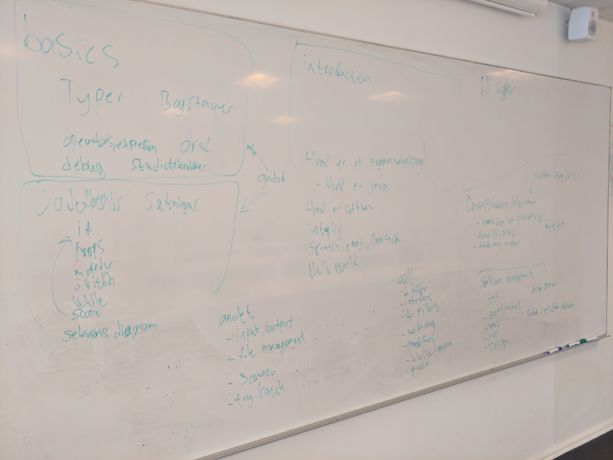
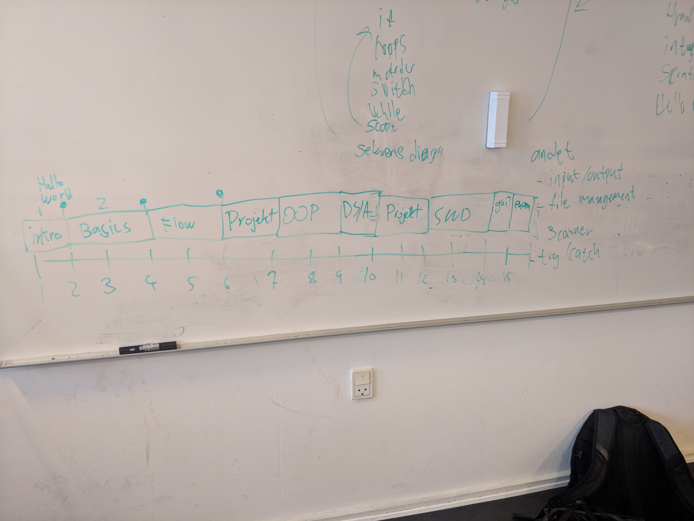

# First meeting

Bogliste

 

## Generel info

Kurset hedder softwareudvikling

## Hvad vil vi på 1. semester?

## Hvad er visionen, hvad skal de studerende kunne efter 1. semester

Vores vision 🎉

- Gode til at debugge
  - Finde fejl
  - Kunne artikulere hvilken fejl de har
  - Redug debugging
- Gode problemløsere
  - Dele et problem op i mindre dele
  - Tænke højt over et problem
  - Think before program!
  - Måske en uge hvor de ikke porgrammerer
- Selvstændige
- Kreative
- Social klasse
  - Pair programming
  - Kage om fredagen (vi kunne spørge klassen hvad de kunne tænke sig med det her)
  - Fremlæggelse
  - Ekstern gæste undervisere

## Rammerne

### Post konditioner: 

https://studkea.sharepoint.com/sites/Datamatikerundervisere/Semesterplanlgning/Forms/AllItems.aspx?viewid=a2e4ccb5%2D6ccc%2D4526%2D9705%2D7244edc57d24&id=%2Fsites%2FDatamatikerundervisere%2FSemesterplanlgning%2FFagaftaler%20%2D%20g%C3%A6ldende%2F1%2E%20semester

Dækningsgrad er et KEA udtryk. Siger noget om hvor meget de studerende skal kunne en lærningsmål. 

### Bundne forudsætninger

https://kea.dk/images/DA/Files/Uddannelser/Studieordninger/STO-Datamatiker-2019-december.pdf

Programmering: 3 bundne forudsætninger. (Afleveres inden første delprøve af 1 årseksamen)

Det er ret løst hvad det betyder. En bunden forudsætning kan godt være 4 dele fx. 

Den studerende skal gøre et forsøg på at bestå. Det handler ikke om at bestå. Det handler om at fremvise reel studieaktivitet. 

Nicklas: individuelle programmerings opgaver som del af bundne forudsætning. 

### Afprøvning

Mundtlig eksamen i 20 min inkl. votering, udfra spørgsmål i læringsmålene. Typisk 15 min. 

Nicklas har eksempler på eksamens spørgsmål. Der er ingen forberedelse

Overveje om vi skal have testprøver for at træne dem 

Overveje om de studerende skal have forberedelses tid til eksamen. 

## Helikopterplan

https://studkea.sharepoint.com/:x:/s/Datamatikerundervisere/EWX9hZthizNPhEWSw55ucRYBbQaRAyMGTAwx978rRyywKA?e=EEdQY

Forskellige emner vi kommer til at køre

- Introduktion - week 1, arrangere fælles
  - Hvad er et programmeringssprog?
    - Hvad er Java
    - Scratch, emoji, brainfuck
  - Hvad er software
  - Intellij
  - Hello world
  - En fra DAT20C/B kommer forbi
  - Studieteknik
  - Problem solving
    - Pseudokode
  - Jons visual tool skal vi have ind her
- Basics
  - Variables, expressions and operators - week 2
    - navne
    - indryk
    - Kommentarer
    - Konsistens
  - String - week 2
  - Reading inputs - week 3
    - Scanner
  - Loops - week 3
    - For
    - Scope
    - While, do while - unddersøger de studerende selv
- Codeflow
  - Metoder - week 4
  - Array - week 4
  - Conditionals and boolean - week 5
    - Switch
  - Debug - week 5
    - Smart at vise i et forloop. Vise at i tæller op ad. 
  - Problem solving - week 5
    - Pseudokode
    - Divide and conquer
  - Sekvensdiagrammer - week 5
    - System
- Project 1 - week 6
- OOP - week 7 - 8
  - Klasser
  - Objekter
  - Nedarvning
  - Interfaces
  - 4 pillars of Java
  - Modifiers
  - Klassediagram
  - GRASP
- Datastrukturer/algoritmer - week 9
  - Arraylist, array
  - Divide and conquor
  - Breakdown af problemer 
- Project 2 - week 10-11
- Software development - week 12 - 13
  - Test
  - Projektbaseret
  - UML
  - RUP
  - Design
  - Binder sammen alt det de studerende har lært
  - Funderet i et stykke software
- 2 ugers lir
- Andet
  - Input/output
  - File management
  - Scanner
  - Try/catch

 

## Systemudvikling

Vi har både design og programmering

 

## Gæstelærer

Folk har glemt hvor dårlige de studerende er. Vi springer over. 

## Gæst

Præsentation af hvordan det er at arbejde i erhvervet med programmering. Ted Talk agtig. Inspirerende, motiverende, konkretesering. Startet virksomhed. 

- Kvindelig KEA alumni måske 
- Måske Klaus kunne komme ud. KEA alumni. https://www.linkedin.com/in/clauskaiser/

## Virksomhedsbesøg

Måske. Mindre relevant. Måske lave det som en tur med KEA. Hvad vil man have ud af det? 

Måske mere relevant for 3. semester. 

## Materialeproduktionsplan

https://trello.com/b/H1fBRKTO/undervisningsmateriale

 

## Feedback

Få nogle fra DAT20C forbi og giv feedback. 

## TA's

Vi har snakket med Patrick Agergaard omkring at bruge nogle af hans folk som TA's i klasserne

## Opdeling

Basics, flow tager benjamin

OOP deler vi

Datastrcutures og softwaredevelopment tager Nicklas

## Ting at overveje

- Bundne forudsætninger - hvilke skal vi have

- Eksamensdato

- Studiestarts prøve

- Midtvejsevalueringer

- Hvad med Git? -  den tager jeg med en af de første dage

- For each in arrayList

- Noget godt fra Patrick Agergaard: Lade dygtigere studerende indgå som ressourcer over for studerende, som kæmper mere for at lære det.

  Tilbyde mange forskellige måder at lære på, når faget tillader det: Video, buddy, tutor, bibliotek osv. Måske løbende følge op på hvad der rører sig ift. disse, så det vedbliver med at være interessant.

  Opgaver, som kan løses dels på flere niveauer (højt, mellem og tilfredsstillende) og dels i flere retninger, så de studerende kan præge løsningen. Dette er også værdifuld feedback til underviserne, fordi der kan hentes gode ideer til fremtidig undervisning + opgaver.

- KEA alumni - for at finde en kvindelig eller iværksætter

- Enum

- Run time vs compile time

## Possible projects

- For methods maybe take the faces exercise over to Thursday and firday, could include booleans, arrays and everything
- Virtual creature could be a fun project
- One button game could also be a possibility
- Voice assistant
- Create some kind of bot
- Experimental chat. Let people interact/chat in a new experimental way
- Creative cryptography- Invent a new way of encrypting and decrypting a message. 
- Synthetic instrument maybe using JavaFeel

