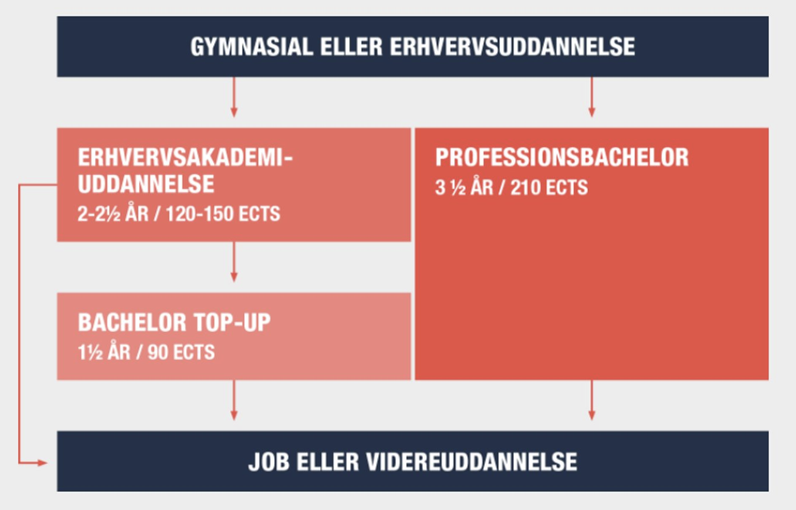
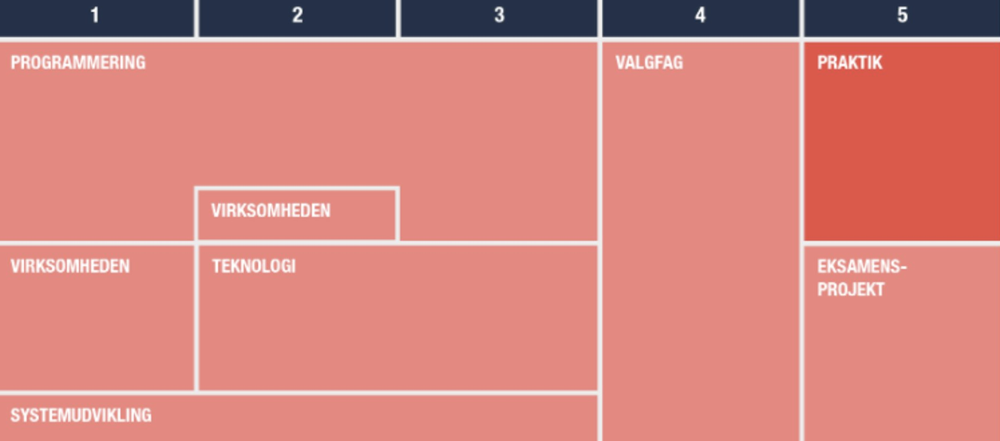
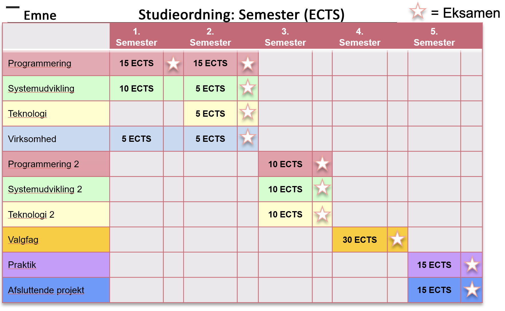

# Monday

- Introduktion
  - Undervisere
  - Datamatikeruddannelsen
  - Det her semester
  - Computer science
  - Hvad er et programmeringssprog
- Besøg af en fra dat20c
- Lav studiegrupper
- Opgaver i grupper

## Introduction

### Undervisere

#### Benjamin Hughes

Digital Media Engineer from DTU. Has worked 8 years with software, primarely as a web developer. Has done interactive graphics at https://www.dr.dk/, been a co-funder at a company called Sunmapper and been an Educational Director for a web coding school called https://www.hackyourfuture.dk/

Follow him on twitter here: https://twitter.com/DalsHughes or see his always slightly outdated portfolio here: https://benna100.github.io/portfolio/

Email: behu@kea.dk

#### Nicklas Frederiksen

### Datamatikeruddannelsen

Hvad vil det sige at være datamatiker? It fagets håndværker. Datamatikeren kender til mange forskellige aspekter af software udvikling, men er praktisk funderet!

**Datamatiker før under og efter**

**Overordnet struktur**

#### Eksamen

Mundtlig eksamen i 20 min inkl. votering, udfra spørgsmål i læringsmålene. Typisk 15 min. Man trækker et spørgsmål og så går man igang. 

#### Generelt om datamatiker uddannelsen

- Ca 400 studerende
- ca. 20 undervisere
- Uddannelseschef - Lars Bogetoft
- Studiesekretær - Marie og Heidi
- Studievejleder - Berit Bergman
- Praktikvejleder - Gitte Juul

#### Obligatoriske opgaver (bundne forudsætninger)

- 3 i programmering
- 2 i systemudvikling
- 1 i virksomhed

**De opgaver skal afleveres for at kunne gå til eksamen!!!**

Der er desuden en studiestartsprøve ca 5 uger efter start

#### Kommunikation

- Fronter - [https://kea-fronter.itslearning.com](https://kea-fronter.itslearning.com/)
  - Semesterplan, bogliste, materialer, opgaver (**HVAD KOMMER VI TIL AT HAVE HVOR???**)
  - Jobannoncer

- E-mail 
  - Al e-mail kommunikation er via din KEA mail
  - Du kan opsætte mail forwarding fra din KEA mail til privat email

- SMS

  - Tilføj mobilnummer: ums.kea.dk

  

- KEAplan 

  - http://keaplan.kea.dk

#### Uge skema

Uge skema. HUSK AT OPDATERE!!!

## Hvordan kommer vores programmering til at forløbe

- Flipped classroom
- Project based
- Fokus på opgaver og projekter
- Programmering skal være kreativt, socialt og sjovt

### Semesterplan

Hele semesterplanen ligger online på den her side: https://behu.gitbook.io/java-first-semester/

Udover det kan i under `lessons` se hvad der specifikt skal arbejdes med på en bestemt dag.  Alle emnerne kan i læse om under `topics`. 

Vi kommer til at have nogle forskellige moduler der hver især får jer tættere på at blive dygtige udviklere. 

Modulerne er

1. Introduction
2. Basics
3. Programflow
4. Object oriented programming
5. Datastructures and algorithms
6. Software development

## Codelab

Der er lektiecafe i det der hedder Codelab. Her kan i få hjælp af nogle studerende der er længere i forløbet end jer. 

https://kea.dk/om-kea/nyheder/kodev%C3%A6rksted-hitter-hos-datamatikere

**DER MANGLER LIGE LIDT HER**

## Opgaver

I jeres studiegrupper skal i lave de her 3 opgaver 👇

- Tegn 20 æbler øvelser - 10 min
- Conditional beach - de forskellige i gruppen får forskellige farver. De skal på skift sætte prikken længst væk fra en anden prik - 10 min
  - Skriv ned hvordan i ville forklare/give instrukser til en maskine om at skulle køre lege den her leg!
- Barcode exercise https://csunplugged.org/en/at-home/unlocking-the-secret-in-product-codes/ - 30 min
