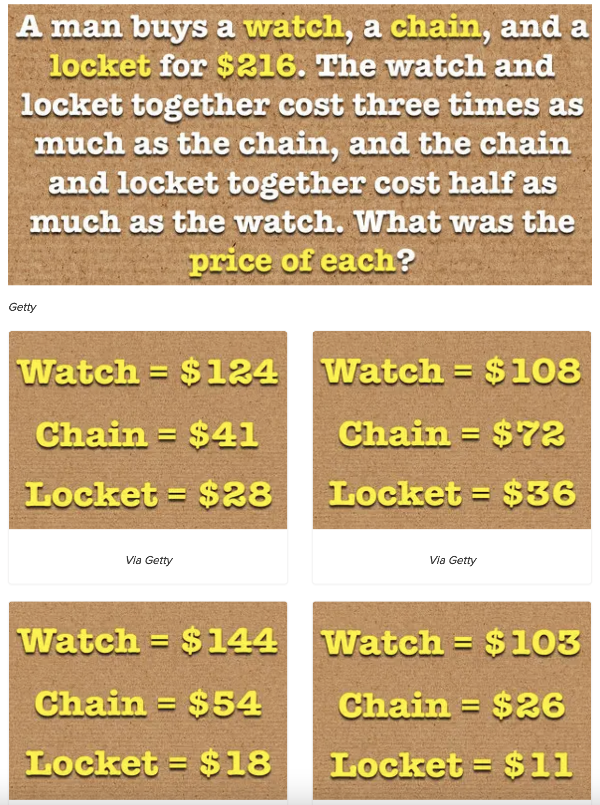
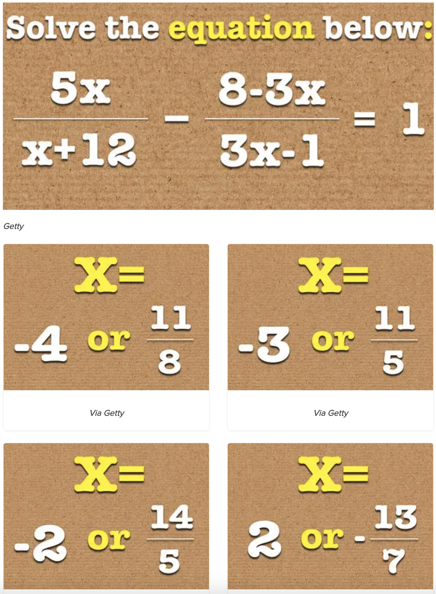
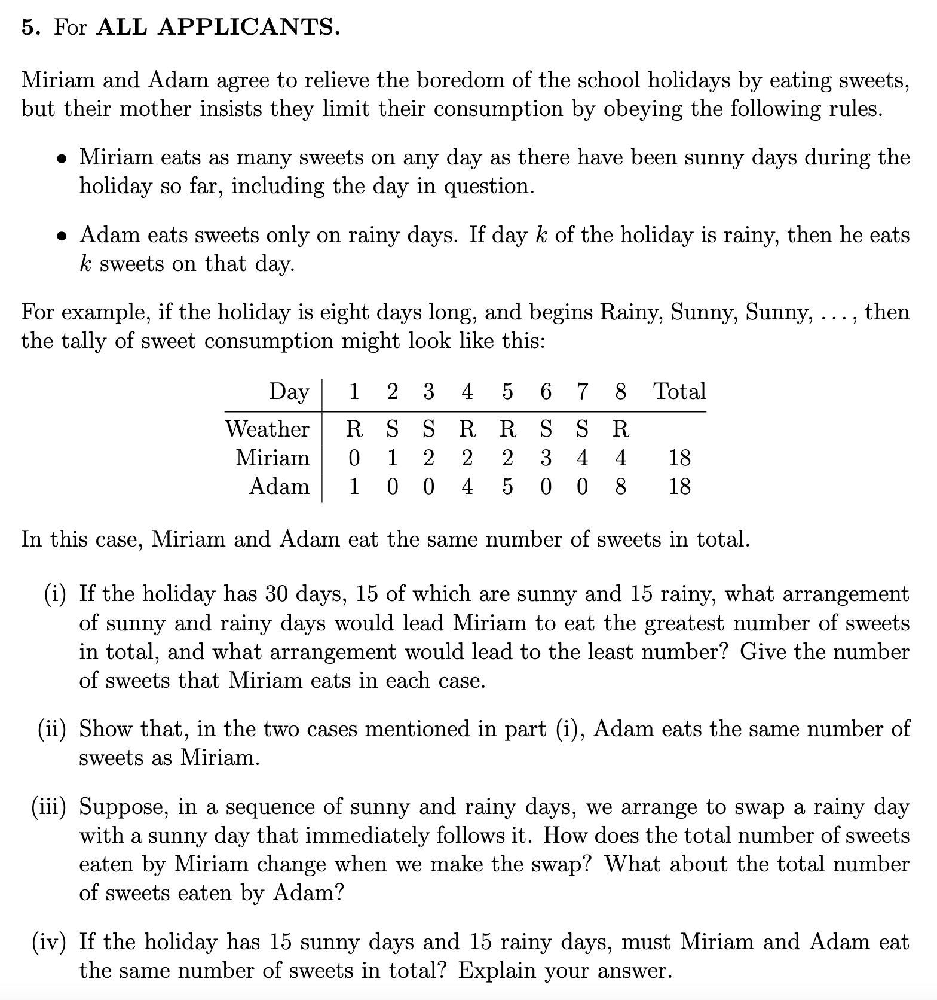

# Tuesday 7/9-2021

- Problem solving
  - Først analyser problem
  - Divide and conquor
  - Tænk højt
- Opgaver
  - Hvor mange tennisbolde er der i en bil
  - hvor mange frisører er der i kæbenhavn
  - hvor meget vand løber gennem ganges i minuttet

Benjamin

## Problem solving

As a programmer most of the time we are solving problems. We get a problem and we need to be the ones that figures out the solution for that problem. Instead of just trying something out to solve the problem we will here give you a framework for solving problmes!

### Understand

The first part of solving a problem is understanding the problem. Here are two quotes that stress the importance of understanding your problem

> “If you can’t explain something in simple terms, you don’t understand it.” — Richard Feynman

> “If I had an hour to solve a problem I'd spend 55 minutes thinking about the problem and 5 minutes thinking about solutions.” - Albert Einstein

So we need to understand the problem before trying to solve it. It makes intuitive sense but what we see is that novice students often spend to little time understanding. To help you understand a problem try some of these methods

- Write the problem down
- Doodle a diagram
- Tell someone else about your problem
- Or use [rubber duck debugging](https://en.wikipedia.org/wiki/Rubber_duck_debugging) (this technique has helped me many many times)

### Plan

Now when we truly understand the problem as well as we can we need to plan for fixing the problem. 

## Exercises

Harvard questions:

Imagine a ladder leaning against a vertical wall with its feet on the ground. The middle rung of the ladder has been painted a different colour on the side, so that we can see it when we look at the ladder from the side on. What shape does that middle rung trace out as the ladder falls to the floor?

### Good for divide

- Hvor mange tennisbolde er der i en bil
- hvor mange frisører er der i kæbenhavn
- hvor meget vand løber gennem ganges i minuttet

HER ER NOGLE GAMLE PRØVER

https://www.maths.ox.ac.uk/study-here/undergraduate-study/maths-admissions-test
