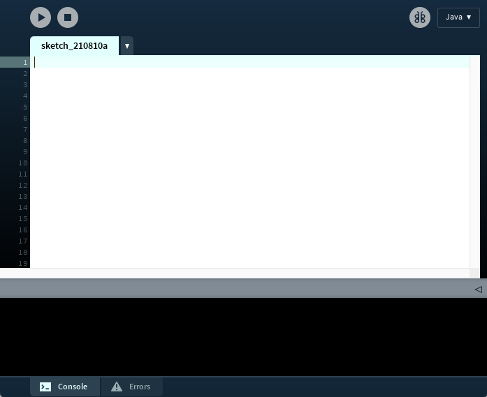

# Wednesday 8/9-2021

<link rel="stylesheet" type="text/css" href="/assets/images.css"/> 

## Processing

Throughout the semester we will be working with the programming language **Java**. Processing is another programming language - typically seen as a **dialect of java** or **java simplified**. 

Processing is completely free and built for electronic arts, new media art and visual design. It will serve as a very basic introductory language to explore and experiment in the initial couple of days.

To download processing: https://processing.org/download/



## What are we trying to do?

We are going to write the most famout program ever made. The **"Hello World"** program.

It is a very simple program, that mostly verifies that everything is up and running.

To write a "Hello World" in processing, we are going to enter the following in the text-edit window: 

```java
println("Hello World");
```


##### To confirm that everything is working - look at the output in the **console** - it should look like this:


### Exercises - hand in

- Draw an X using lines like this: 

- Change the background to white

- Answer: Why does this program not work as intended:

- ```java
  size(100,100);
  line(0,0,500,500);
  background(255);
  line(0,100,100,0);
  ```

- Explain what happens in the code and how to fix it

- Draw a figure - you can use any shape, line and color

  - Examples: 

    
    
    
  
  

### Project

We are going to build a very simple version of the classic program MS. Paint

## FAQ - Common methods

