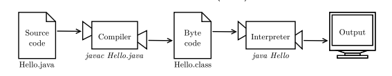

# Friday 10/9-2021


## 📣 The winners

### Best sketchers:

### Best guessers:


## Hello Intellij

Today we are progressing to a new editor called IntelliJ.

Intellij is a professionel development tool for writing programs. It is one of the most popular tools for java and we will be using this Integrated Development Environment (IDE) throughout the semester. 

It is recommended to use **IntelliJ Ultimate Edition** which is a premium solution (meaning you have to pay for a license)

You **do** have a license for IntelliJ Ultimate Edition - activate it by registering with your KEA e-mail. 

Use your KEA e-mail to register here: https://www.jetbrains.com/community/education/#students


**AFTER** registering a Jetbrains user with your @stud.kea.dk e-mail - download intelliJ ultimate edition from here: https://www.jetbrains.com/idea/download/


## The compiling process



## FAQ

To compile a program: 

```
javac HelloWorld.java
```

To run a program:

```
java HelloWorld
```

Output should be:

```
Hello World
```

If the program looks like this:

```java
public class HelloWorld{
	public static void main(String[] args){
		System.out.println("Hello World");
	}
}
```
