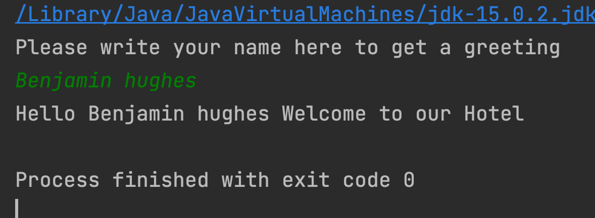
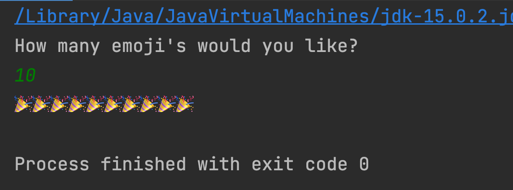

# No code Wednesday

Peer instruction day!

Parsons problems


## Parsons problems


### Exercise 1

Solve this Parsons problem.

The program will in larger terms

- Ask a user to write his/her name
- With the name call the `getGreetingMessage`
- Log out the return of the method

http://parsons.problemsolving.io/puzzle/fa106f6e662d48a8886558e72a57b549

<!--

```
public static void main(String[] args) {
    Scanner scanner = new Scanner(System.in);
    System.out.println("Please write your name here to get a greeting");
    String fullname = scanner.nextLine();
    String greeting = getGreetingMessage(fullname);
    System.out.println(greeting);
}

public static String getGreetingMessage(String fullname) {
    String greeting = "Hello " + fullname + " Welcome to our Hotel";

    return greeting;
}
```

 -->




### Exercise 2

Solve this Parsons problem

The program will in larger terms

- Ask the user for a number of emojis to be printed
- With the number of emojis call a method to get the emojis to print
- Print the emojis

http://parsons.problemsolving.io/puzzle/8568731ac447431fb872b3f23d968391

<!--

```
public class emojiPrinter {
    public static void main(String[] args) {
        Scanner scanner = new Scanner(System.in);
        System.out.println("How many emoji's would you like?");
        int numberOfemojis = scanner.nextInt();
        String pattern = getPattern(numberOfemojis);
        System.out.println(pattern);
    }

    public static String getPattern(int numberOfemojis) {
        String pattern = "";
        for (int i = 0; i < numberOfemojis; i++) {
            pattern += "🎉";
        }

        return pattern;
    }
}
```

-->

Here is the output from running the program





## Peer instruction

Methods, loops, not array or conditional


## Exercise 3

What will the following code output? 

```java
int i;
for(i=6; i<=10;i++);  
System.out.println(“i is ” + i);
```

1. `i is 6`
2. `i is 9`
3. `i is 10`
4. `i is 11`
5. `Will not compute`


### Exercise 4

What will the following code output

```java
public class NumberOfCharacters {
    public static void main(String[] args) {
        int numberOfCharacters = getNumberOfCharacters("speciallægepraksisplanlægningsstabiliseringsperiode");
        System.out.println(numberOfCharacters);
    }

    public static int getNumberOfCharacters(String word) {
        System.out.println(word.length());
    }
}
```

- `50`
- `51`
- `null`
- Does not compute


### Exercise 5

```java
public class FirstCharacter {
    public static void main(String[] args) {
        String firstCharacter = getFirstCharacter("speciallægepraksisplanlægningsstabiliseringsperiode");
        System.out.println(firstCharacter);
    }

    public static char getFirstCharacter(String word) {
        return word.charAt(1);
    }
}
```

- `s`
- `p`
- `0`
- Does not compute

