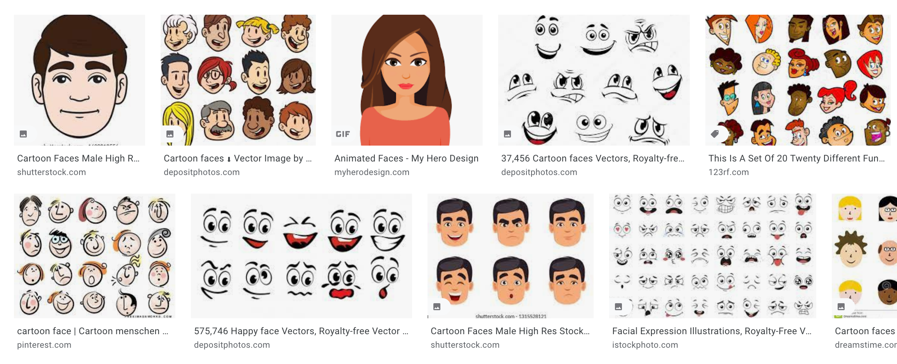

# Thursday


## Face creator

> The games studio Activition has contacted KEA to get the sharpest minds to work on a problem they have. Sadly DAT21B was not available therefore DAT21A has gotten the task. 
>
> Activision is creating a new game but their face generation software has mysteriously dissapeared in a data fire. So now we have to create code for generating random faces. **LOTS** of random faces!


## Getting started

To begin with you have to create a new Javafx project in IntelliJ. You do that in IntelliJ by clicking File -> New -> Project.. -> JavaFX

Give the project a name and a location. 

> To make this work with git. Create your repo in GitHub first. Clone that empty repo to your computer. Then when choosing the location simply select the location of the github repo!

Dont change any of the setting and click Next. Dont add any Dependencies and click on Finish.

You will now be taken to a `HelloApplication.java` file. Replace that file with the following code 👇 Now import the missing classes by hovering over a red variable and choosing Add import (i think it's called)

```java
package com.example.javafx;

import javafx.application.Application;
import javafx.fxml.FXMLLoader;
import javafx.scene.Group;
import javafx.scene.Scene;
import javafx.scene.canvas.Canvas;
import javafx.scene.canvas.GraphicsContext;
import javafx.scene.paint.Color;
import javafx.stage.Stage;

import java.io.IOException;

public class HelloApplication extends Application {
    static Canvas canvas = new Canvas(650, 700);
    static GraphicsContext gc = canvas.getGraphicsContext2D();

    @Override
    public void start(Stage stage) throws IOException {
        FXMLLoader fxmlLoader = new FXMLLoader(HelloApplication.class.getResource("hello-view.fxml"));

        Group root = new Group();
        Scene scene = new Scene(root, 600, 600);
        stage.setTitle("Face");
        stage.setScene(scene);

        gc.clearRect(0,0,600,600);
        root.getChildren().add(canvas);

        drawPrimitiveFace();

        stage.show();
    }

    public static void drawPrimitiveFace() {
        drawShape();
        drawMouth(50);
        drawEyes();
    }

    public static void drawShape() {
        gc.strokeOval(150, 150, 300, 300);
    }

    public static void drawMouth(int mouthSize) {
        gc.setFill(Color.BLACK);
        gc.fillOval(280,370,mouthSize,mouthSize);
    }

    public static void drawEyes() {
        gc.setFill(Color.BLACK);
        gc.fillOval(220,220,20,20);
        gc.fillOval(360,220,20,20);
    }

    public static void main(String[] args) {
        launch();
    }
}
```

Try and run this code and you should now see a very crude face. Take a look at the methods i have created to get inspired of how to draw the whole face

---

Your task is to create faces by calling different methods. This is a very open task and you choose how to do it. Creativity is appreciated 🤩 Here are the requirements

- You should create more than 4 methods for this task
  - They all need to have parameters
  - Some should return values using `return` some should not
  - Example could fx be `public static void drawEyes(double distanceBetweenEyes, int numberOfEyes)`, `drawNose`, etc
- You should show that you can use different kinds of loops
- You should use an `if` `else` sentence
- Use the modules operator `%`
- The first part of the program should take input from the user


Here is an example of how a method could look. 

```java
public void generateFace(boolean isSmiling, int numberOfEyes, String hairColor) {
   	...
}
```

To figure out how to draw different shapes take a look at this article: https://edencoding.com/javafx-canvas/ or this youtube video: https://www.youtube.com/watch?v=vaXuK-RsT6E





### Continously generate new random faces

Now have a method that can be used to generate new faces. Now we need the randomness!

Every 2 seconds generate a new random face usign your `generateFace` method. Hopefully it will look super awesome 🖼👩‍🎨👨🏼‍🎨

**You should not take input from the user anymore, everything should be random!**

After the `stage.show();` line add this code to continously generate a new face every second:

```java
Timeline timeline = new Timeline(new KeyFrame(Duration.seconds(0.1), event -> {
    gc.clearRect(0, 0, 600, 600);
    try {
        drawPrimitiveFace();
    } catch (InterruptedException e) {
        e.printStackTrace();
    }
}));
timeline.setCycleCount(360);
timeline.play();
```


### Create gif

Create a gif showing the changing faces and include that in your upload on Fronter

You can use this tool: https://www.screentogif.com/


## Handing in

The project code should be added to a public github repo. Hand in 

- The github link on Fronter!
- The gif of the changing faces

**Should be handed in before the 17/9**

There will be a judge that judges the ones that uploaded a gif of the changing faces. There will be a small price 🏆 

