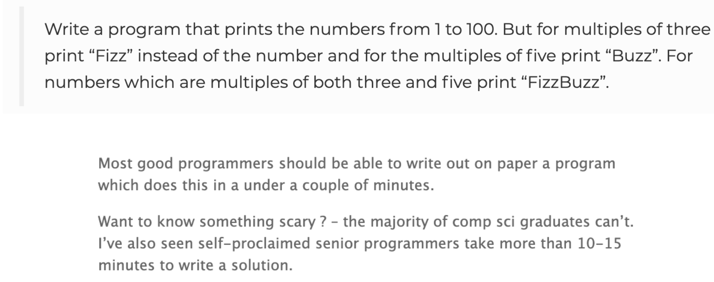

# Monday

##### Problem solving

Software development & programming consists mainly of two parts - understanding a requirement & engineering a solution to match. To engineer anything - the most valuable skill is not remembering syntax, but the more abstract skillset of problem solving.

This is why we will be walking through a tough set of requirements today - step by step - and engineer a solution to match. To solve any problem of a certain complexity, it is required to divide the problem into smaller sub-problems and engineer solutions for that. In the end, the sum of solutions to the sub-problems will solve the larger scale problem.

As a novice programmer getting stuck on a problem is the norm. Getting stuck is both frustrating & discouraging:

##### **The curious case of FizzBuzz**



Source: http://www.imranghory.org/

##### **How to overcome problems**

> Every student struggles. When they try to guess what will be the hardest parts of their journey, they usually describe configuring servers, learning how memory works, or writing code to save information.
>
> But the hardest part is less technical and more psychological.
>
> The hardest part is *getting unstuck*.
>
> The experience of encountering annoying and unexpected problems is a daily occurrence for software developers, and a lot of beginners are simply not aware of these challenges that will arise.
>
> Without the right mentality, a regular barrage of difficult and surprising problems can make learning how to code frustrating. Some developers even start to doubt their own abilities, which can feed into impostor syndrome.
>
> Books, online tutorials, and group classroom-style training don't teach as effectively as mentorship. These resources cannot tailor an individual student's learning. They don't teach students how to ask the right questions or how to break down complex problems and think about them in different ways. And they aren't good at keeping students on track, accountable, and motivated.
>
> The Internet has some wonderful resources for getting started on this skill yourself. Read about the most effective way to improve programming skills on Programmers Stack Exchange. Quora discusses the appropriate length of time to be stuck on a problem.
>
> **1.** **Write your question down succinctly**
>
> Describe your MCVE. An MCVE attempts to reproduce the problem in the smallest amount of code possible. This helps isolate the cause, and narrow down exactly what you're trying to solve. Oftentimes, just understanding what *is* the exact problem is the biggest step toward getting unstuck.
>
> **2.** **Describe the problem aloud**
>
> It's so easy to get stuck in your head when you're programming. Sometimes, simply talking out your problem will help you think more clearly, and find a logical solution. It frees up your brain, and can be the simple solution to getting unstuck.
>
> **3.** **Search and post on Stack Overflow**
>
> Stack Overflow is a developer's best friend. More likely, your question has been asked and answered on the site, so make sure to do a quick search before getting too hard on yourself. Everyone gets stuck, and Stack Overflow proves it. If you're looking for something more hands on, I recommend Bloc's online coding bootcamp.Their camps are an amazing way to work with a world-class curriculum and 1-on-1 with an mentor that'll help teach you how to get unstuck, and techniques for becoming a more thoughtful programmer.
>
> **4. Take a break!**
>
> Often, stepping away from your monitor and freeing your thoughts will bring you new perspectives on how to solve a problem. This is especially true when coding. Get your mind away from the issue by going for a walk or participating in an unrelated activity.
>
>  A.J Agrawal, CEO of Verma Media & Alumnify

### Dice Guess

Todays project is the game of dice-guess. In this game, the computer will roll an imaginary dice & the user will be guessing whether the dice is even or odd.

In your study groups:

- Describe the sub-problems from the requirements in writing
- Write pseudocode
- Implement the solution

We will be looking at progress from one group at the end of class


##### Extra credit for: 

- A high score count
- Average number of rolls until failure
- Another game mode with 2 dices rolled. The user has to guess whether 1 of the dice are even or odd.

<!--

Masser af gode rigtige interview spørgsmål her: https://www.byte-by-byte.com/choosing-practice-questions/


### Exercise 1

Write a Java program to find the length of the longest consecutive elements sequence from a given unsorted array of integers.

Sample array: `[49, 1, 3, 200, 2, 4, 70, 5]`. The longest consecutive elements sequence is `[1, 2, 3, 4, 5]`, therefore the program will return its length 5.


### Exercise 3

Write a Java program to separate even and odd numbers of a given array of integers. Put all even numbers first, and then odd numbers


### Exercise 4

Write a Java program to check if a given array contains a subarray with 0 sum. 

Example:

Input :

```
nums1= { 1, 2, -2, 3, 4, 5, 6 }
nums2 = { 1, 2, 3, 4, 5, 6 }
nums3 = { 1, 2, -3, 4, 5, 6 }
```

Output:Does the said array contain a subarray with 0 sum: true

Does the said array contain a subarray with 0 sum: false

Does the said array contain a subarray with 0 sum: true


### Exercise 5

Write a Java program to find maximum product of two integers in a given array of integers. 

Example:

Input :

nums = { 2, 3, 5, 7, -7, 5, 8, -5 }

Output:

Pair is (7, 8), Maximum Product: 56


### Exercises lots and lots and lots and lots of EXERCISESSSSSSSSSSSS

**Arrays**

How do you find the missing number in a given integer array of 1 to 10?

How do you find the duplicate number on a given integer array?

How do you find the largest and smallest number in an unsorted integer array?

How do you find all pairs of an integer array whose sum is equal to a given number?

How do you find duplicate numbers in an array if it contains multiple duplicates?

How are duplicates removed from a given array in Java?

How is an integer array sorted in place using the quicksort algorithm?

How do you remove duplicates from an array in place?

How do you reverse an array in place in Java?


**Strings**

How do you check if two strings are anagrams of each other?

How do you print the first non-repeated character from a string?

How do you find all permutations of a string?

How do you check if two strings are a rotation of each other?

How do you check if a given string is a palindrome?


**General**

Find the median of two sorted arrays. Click for the solution.

Given two strings, write a function that returns the longest common substring. 

Compress a string by shortening every repeated char to that char followed by the number of repetitions. 


Implement fizz buzz in Java

https://leetcode.com/problems/fizz-buzz/

-->