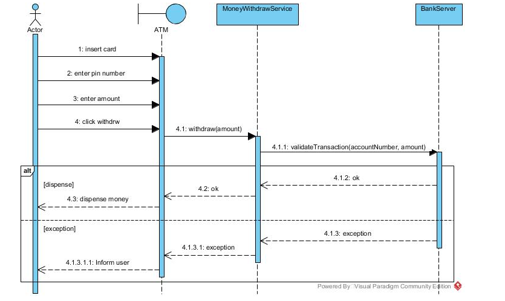

# Tuesday

#### Visual paradigm

Going forward we will be drawing diagrams to design & document code. 

Download visual paradigm and use the following academic license by following this guide:

[KEA - Visual Paradigm 2021 v16_3_20210824.pdf](assets/KEA - Visual Paradigm 2021 v16_3_20210824.pdf) (Download .pdf for working links)

### Three steps to improve code quality and document changes:

#### Exercise 1 - Document program:

- Finish the diagram such that it documents the Crypto Converter program:  [system-sequence-diagrams.md](../../topics/03 - programflow/system-sequence-diagrams.md)

#### Exercise 2 - Refactor code:

- Implement error handling as a try/catch in your Crypto Converter
- If the user enters input that does not contain numbers
  - Handle the exception by informing the user of wrong input and ask the user for input again

#### Exercise 3 - Update documentation:

- Update the documentation such that the newly refactored code is documented
- This can be modelled as an alt scenario:

#### Extra Credit: NemId Authorizer

Create a method called ”NemIdAuthorizer”. 

NemIdAuthorizer returns a boolean value. 

isValidInput receives two parameters: String cpr & String password.

- If cpr does not adhere to a valid cpr number - the method will throw a new InputMismatchException
- If InputMismatchException is thrown - the program will inform the user and request another input
