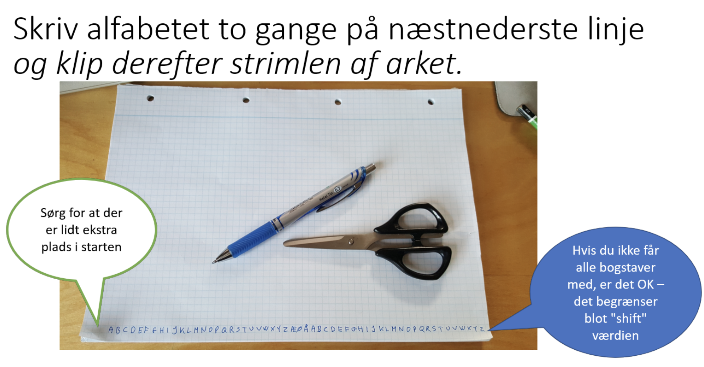
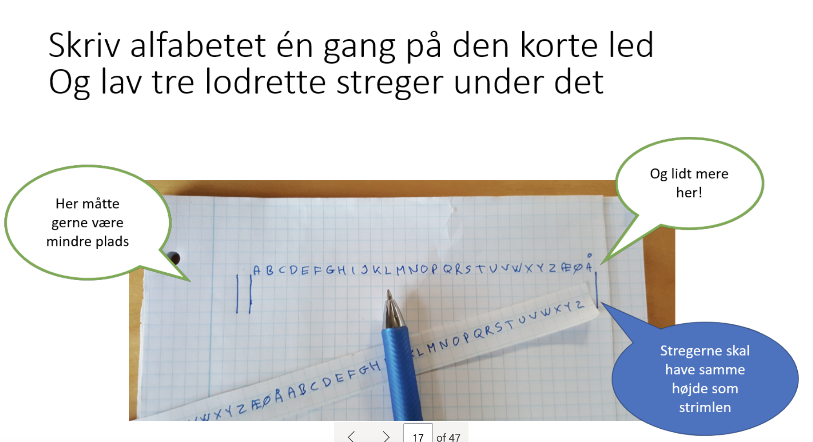
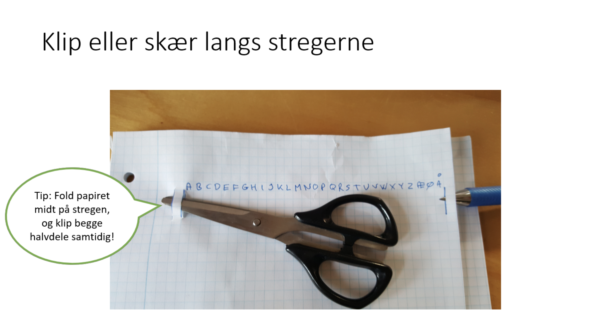
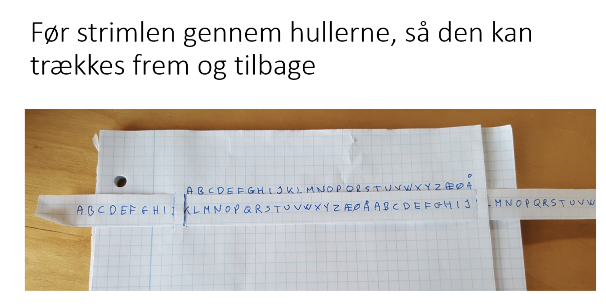
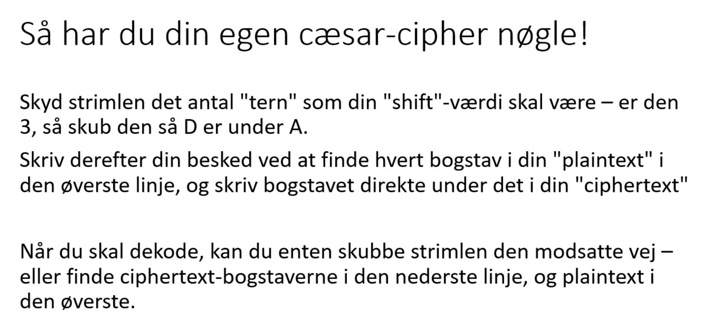

# Wednesday


## Number cipher

A number cypher takes a word and converts all charcters to numbers. The numbers are equal to the order of the character in the alphabeat. Here is an example:

```
abc -> 1;2;3
ben -> 2;5;14
hello -> 8;5;12;12;15
```

Physically encode a message and send it to a receiver in another group. Verify if they got the right answer!

See if everyone can get to both encode (word to code) and decode (code to word)


## Caesar cipher

Caesar cypher works similar to number cypher. Now instead of just encoding a message to numbers, we encode them to new characters. But the new characters are shifted 3 to the right. Watch this video that explains the process super well: https://youtu.be/o6TPx1Co_wg

This video is also really good: https://www.youtube.com/watch?v=sMOZf4GN3oc

https://youtu.be/Kf9KjCKmDcU

Now you will have to make a physical Caesar cypher 👇

Here are some examples:

```
abc -> def
ben -> ehq
Hello -> khoor
```












Try to both encode a message and decode a message. That means

- Send a message to a person in another group. Can they correctly decode your message?
- Receive a message from someone in another group. Can you decode that correctly?
- Now try and play around with
  - Shift number - What if you instead of shifting 3 shifted 5 or 15. How would that look
  - Shift direction - What if you instead of shifting to the right shifted to the left
  - Encode a message where you send the shift number and shift direction with it. Can they still get the correct message?


## Let's get coding!

Let's build some encryption helper methods!


### `characterToIndex`

This method will be used for encoding our message!

Create a method called `characterToIndex`. The method takes a character and returns the index. 

> Remember the index for number cypher starts at 1 not 0!

```java
int indexOfCharacterA = characterToIndex('a');
System.out.println(indexOfCharacterB); // 1

int indexOfCharacterE = characterToIndex('e');
System.out.println(indexOfCharacterB); // 5
```


### `indexToCharacter`

This method will be used for decoding our message!

Create a method called `indexToCharacter`. The method takes an integer and returns the character for that index. 

> Remember the index for number cypher starts at 1 not 0!

```java
char characterForindex1 = indexToCharacter(1);
System.out.println(characterForindex1); // a

int characterForindex5 = indexToCharacter(5);
System.out.println(characterForindex5); // e
```


### `ceasarCharacterEncoder`

This is the method that will help encode our message!

`ceasarCharacterEncoder` should take a character and return a new encoded character using the Caesar cypher:

```java
char CharacterBEncoded = ceasarCharacterEncoder('b');
System.out.println(CharacterBEncoded); // e

char CharacterYEncoded = ceasarCharacterEncoder('y');
System.out.println(CharacterYEncoded); // b
```

> Consider using modulus for this task


### `ceasarCharacterDecoder`

This is the method that will help decode our message!

`ceasarCharacterDecoder` should take a encoded character and return a new decoded character using the Caesar cypher:

```java
char CharacterEEncoded = ceasarCharacterEncoder('e');
System.out.println(CharacterEEncoded); // b

char CharacterBEncoded = ceasarCharacterEncoder('b');
System.out.println(CharacterBEncoded); // y
```

> Consider using modulus for this task


## Projecttime

You can now start on the project!


