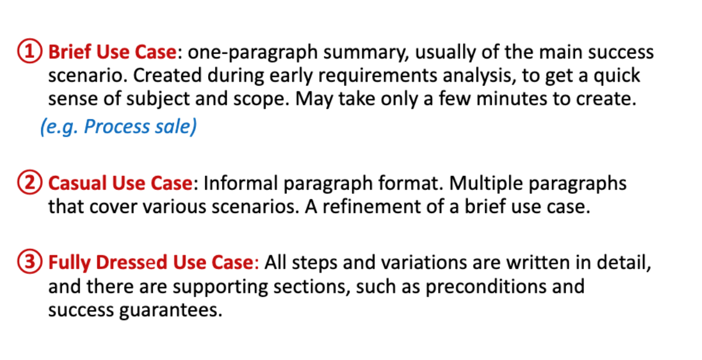

# Software Development Introduction & Use Cases

Today will serve a unusual lengthy lecture an introduction to the subject area of *Systems Design*/Systemudvikling

Agenda:

- Who/what of Applying UML and Patterns
- The concept and motivation for Object Oriented Design and Analysis (OOAD)
- Object Orientation as a way of thinking, designing & engineering
- Introduction to Use Cases

### Use cases:

Use cases are written from the perspective of **actors** and defined in a **scenario**.

An actor is something with behaviour, such as a person/user, computer system or organization.

A Scenario is a specific sequence of actions and interactions between actors and the system (also known as a use case instance). It is one particular story of using a system - one path through the use case.

- For example searching Momondo for a flight to a particular destination and ending up booking and ordering the ticket(s)

Use cases are considered **functional requirements** as they dictate **how a system should function**

- What feature it should have, to live up to the requirements

#### Use cases exists in three formats:

#### Exercise 1

Consider a store such as ProShop, Zalando or Amazon - choose a case.

- Consider - what makes this shop unique?
  - Is it customer to customer sale?
  - Are the items second-hand?

- Describe two brief use cases from the perspective of a potential customer
- Refine one of them to a casual use case
- Refine That one to a fully single use case

#### Exercise 2

- Create a use case diagram for a user 

#### Exercise 3 (Advanced)

- Describe two brief use cases from the perspective of a administrator
- Refine one of them to a casual use case
- Refine That one to a fully single use case

#### Exercise 4 (Advanced)

- Create a use case diagram for an administrator/seller

