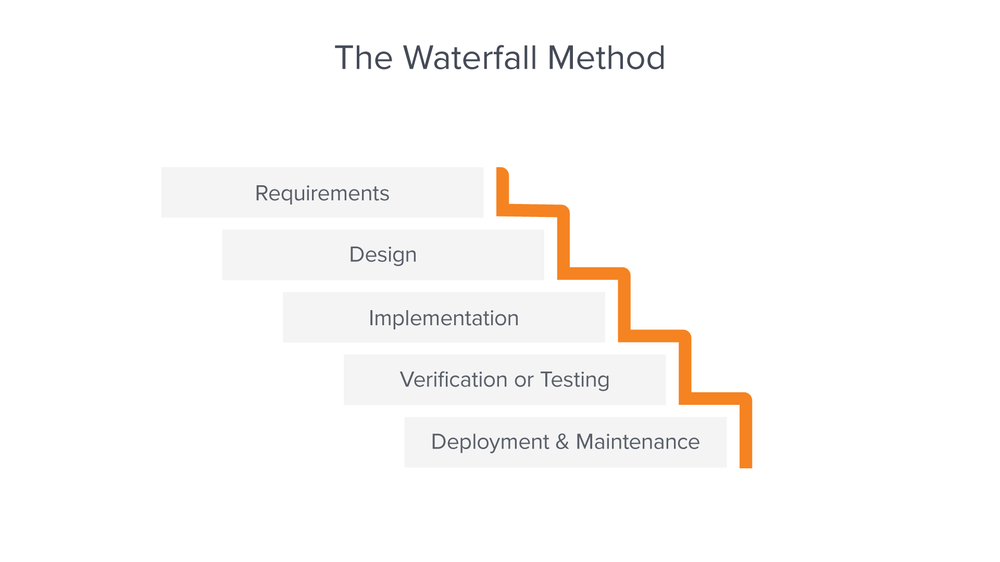

# Software Development Processes

Source: https://www.workfront.com/project-management/methodologies/waterfall

## What is the Waterfall methodology? 

The Waterfall methodology—also known as the Waterfall model—is a sequential development process that flows like a waterfall through all phases of a project (analysis, design, development, and testing, for example), with each phase completely wrapping up before the next phase begins.

It is said that the Waterfall methodology follows the adage to “measure twice, cut once.” The success of the Waterfall method depends on the amount and quality of the work done on the front end, documenting everything in advance, including the user interface, [user stories](https://www.workfront.com/project-management/methodologies/agile/user-stories), and all the features’ variations and outcomes. With the majority of the research done upfront, [estimates of the time needed](https://www.workfront.com/project-management/methodologies/agile/story-points) for each requirement are more accurate, and this can provide a more predictable release date. With a Waterfall project, if parameters change along the way, it’s harder to change course than it is with [Agile methodology](https://www.workfront.com/project-management/methodologies/agile).

------

**Ebook:** [20 Experts Share Secrets For Balancing Agile and Waterfall](https://www.workfront.com/resources/20-experts-share-secrets-for-balancing-agile-and-waterfall)

**Whitepaper:** [The Manager's Guide to Mixing Agile and Waterfall](https://www.workfront.com/resources/solve-the-pain-of-mixing-agile-and-waterfall)

------

## 5 common stages in a Waterfall process

The Waterfall methodology follows a chronological process and works based on fixed dates, requirements, and outcomes. With this method, the individual execution teams aren’t required to be in constant communication and, unless specific integrations are required, are usually self-contained. Team members also tend to work independently and aren’t expected to provide [status reports](https://www.workfront.com/project-management/life-cycle/monitoring-controlling/status-reports) as often as with the Agile approach. Usually, one phase doesn’t begin until the previous one is finished.

Using a software development project as an example, the Waterfall process usually includes stages that look like this:

### Requirements

The Waterfall methodology depends on the belief that all [project requirements](https://www.workfront.com/project-management/knowledge-areas/scope-management/requirements-management) can be gathered and understood upfront. The [project manager](https://www.workfront.com/project-management/career/project-manager) does their best to get a detailed understanding of the project sponsor’s requirements. Written requirements, usually contained in a single document, are used to describe each stage of the project, including the [costs](https://www.workfront.com/project-management/knowledge-areas/cost-management), assumptions, [risks](https://www.workfront.com/project-management/knowledge-areas/risk-management), dependencies, [success metrics](https://www.workfront.com/project-management/metrics), and [timelines](https://www.workfront.com/project-management/knowledge-areas/time-management/project-timeline) for completion. 

### Design

Here, software developers design a technical solution to the problems set out by the product requirements, including scenarios, layouts, and data models. First, a higher-level or logical design is created that describes the purpose and [scope of the project](https://www.workfront.com/project-management/knowledge-areas/scope-management/project-scope), the general traffic flow of each component, and the integration points. Once this is complete, it is transformed into a physical design using specific hardware and software technologies. 

### Implementation

Once the design is complete, technical implementation starts. This might be the shortest phase of the Waterfall process, because painstaking research and design have already been done. In this phase, programmers code applications based on project requirements and specifications, with some testing and implementation taking place as well. If significant changes are required during this stage, this may mean going back to the design phase. 

### Verification or testing

Before a product can be released to customers, testing needs to be done to ensure the product has no errors and all of the requirements have been completed, ensuring a good user experience with the software. The testing team will turn to the design documents, personas, and user case scenarios supplied by the product manager to create their test cases. 

### Deployment and maintenance

Once the software has been deployed in the market or released to customers, the maintenance phase begins. As defects are found and change requests come in from users, a team will be assigned to take care of updates and release new versions of the software.

## Advantages of the Waterfall methodology

The Waterfall methodology is a straightforward, well-defined [project management methodology](https://www.workfront.com/project-management/methodologies) with a proven track record. Since the requirements are clearly laid out from the beginning, each contributor knows what must be done when, and they can effectively plan their time for the duration of the project.

Other benefits of the Waterfall method include:

- Developers can catch design errors during the analysis and design stages, helping them to avoid writing faulty code during the implementation phase.
- The total cost of the project can be accurately estimated, as can the timeline, after the requirements have been defined.
- With the structured approach, it is easier to measure progress according to clearly defined milestones.
- Developers who join the project in progress can easily get up to speed because everything they need to know should be in the requirements document.
- Customers aren’t always adding new requirements to the project, delaying production.

## Disadvantages of the Waterfall methodology

Like any development process, the strengths in one area might mean weaknesses in the other. The Waterfall methodology’s insistence on upfront [project planning](https://www.workfront.com/project-management/life-cycle/planning) and commitment to a certain defined progress means that it is less flexible, or agile, later in the game. Changes that come further in the process can be time-consuming, painful, and costly.

Other reasons the Waterfall methodology [may not work](https://www.workfront.com/blog/5-reasons-your-project-management-process-isnt-working) include:

- Projects can take longer to deliver with this chronological approach than with an iterative one, such as the Agile method.
- Clients often don’t fully know what they want at the front end, opening the door to requests for changes and new features later in the process when they’re harder to accommodate.
- Clients are not involved in the design and implementation stages.
- Deadline creep—when one phase in the process is delayed, all the other phases are delayed.

------

**Whitepaper:** [Creating a Process That Works](https://www.workfront.com/resources/creating-a-process-that-works)

**Ebook:** [11 Lessons That Will Make Your IT Team Faster, Happier, and More Productive](https://www.workfront.com/resources/11-lessons-that-will-make-your-it-team-faster-happier-and-more-productive)

------

## Who uses the Waterfall model?

The Waterfall process is adopted by project managers who are faced with development projects that:

- Don’t have ambiguous requirements.
- Offer a clear picture of how things will proceed from the outset.
- Have clients who seem unlikely to change the scope of the project once it is underway.

If a project manager prefers clearly defined processes, where cost, design, and [time requirements](https://www.workfront.com/project-management/knowledge-areas/time-management) are known upfront, then the Waterfall method is the way to go, as long as the project itself is conducive to those constraints.

## Waterfall project management FAQs 

### What is the difference between the Waterfall and Agile approaches to project management?

While the Waterfall model relies on thorough up-front planning in which each phase must be fully completed before the next one starts, Agile is a more flexible, iterative process that tackles the planning, design, implementation, and testing tasks in shorter, repeating cycles. 

With Waterfall, the customer doesn’t usually play a hands-on role once their requirements have been collected. With Agile, the customer has greater input throughout development. Instead of having Waterfall milestones, Agile works in “[sprints](https://www.workfront.com/project-management/methodologies/scrum/sprints),” where prioritized tasks are completed in short windows of time, such as two weeks.

Learn more about [Agile vs. Waterfall](https://www.workfront.com/project-management/methodologies/agile/agile-vs-waterfall)

### When can design changes be made in the Waterfall process?

Alterations are easy to accommodate in the early stages of development, such as when the project manager is still fleshing out the specification documents with the development team and clients. Later in the Waterfall process, once coding has already begun, design changes can be difficult and expensive to make.

### What other benefits are there to Waterfall’s organized structure?

While the Waterfall methodology may sound overly restrictive for certain kinds of projects, it can be a great way to keep a well-defined, predictable project from exceeding time and budget guidelines. The clear and detailed organization can also help during complex projects that involve a lot of people working toward a clearly outlined goal.

# Rational Unified Process

https://medium.com/adamedelwiess/software-development-process-10-rational-unified-software-process-and-phases-in-a-cycle-1b5533673341

## Exercise:

**Individually**

Describe the waterfall model in 500 words or less

Describe Rational Unified Processes in 500 words or less

- Swap your description with the person next to you

What are the differences? 

What are the similarities? 

How can disputes be solved?
