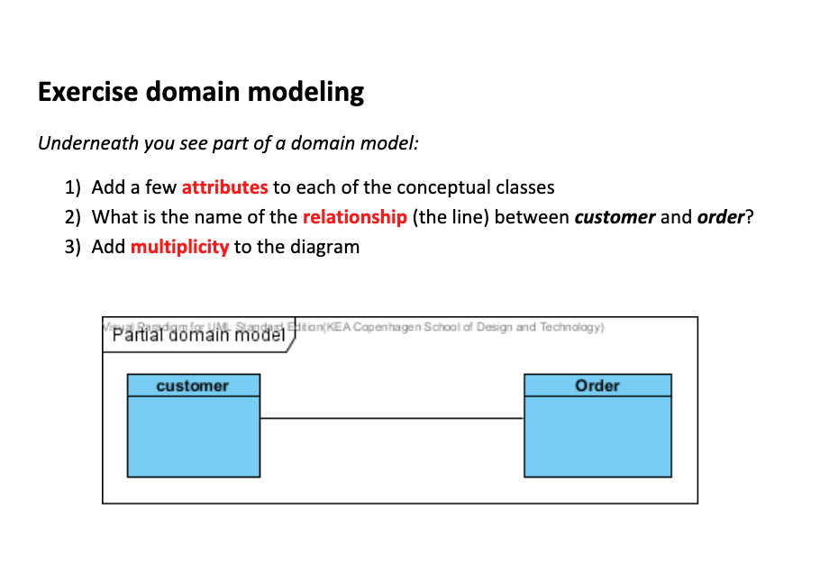
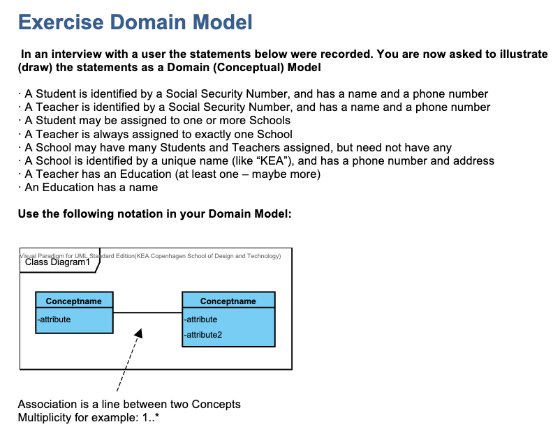
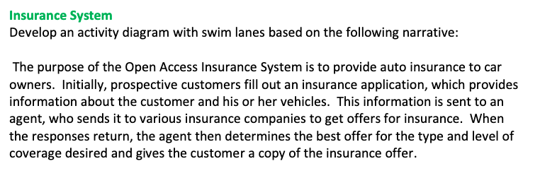
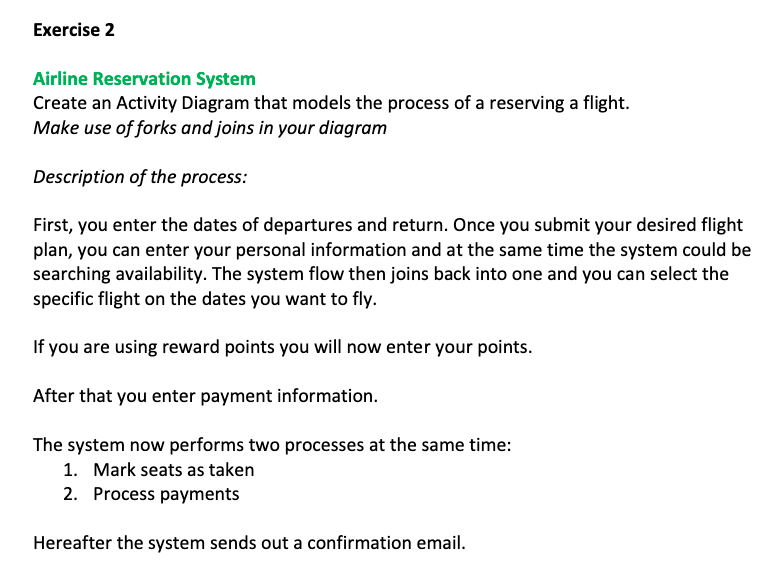

# Domain model, (System) Sequence Diagram & Activity Diagram

### Exercise 1:

### Exercise 2: 

## Activity Diagrams 

### Exercise 1:

- Describe your morning routine in an activity diagram

### Exercise 2:

### Exercise 3:

## Expert interview

- In groups of 2-3
- Either: 
  - Pick a domain/topic that an "expert" in the group knows a lot about (League of Legends, Game of Thrones, Breakdancing, Reddit etc.)
  - The rest of the group interviews the expert about the topic, such that they can model a domain model
- Or model the following concept, based on the description from here: https://youtu.be/SSo_EIwHSd4
