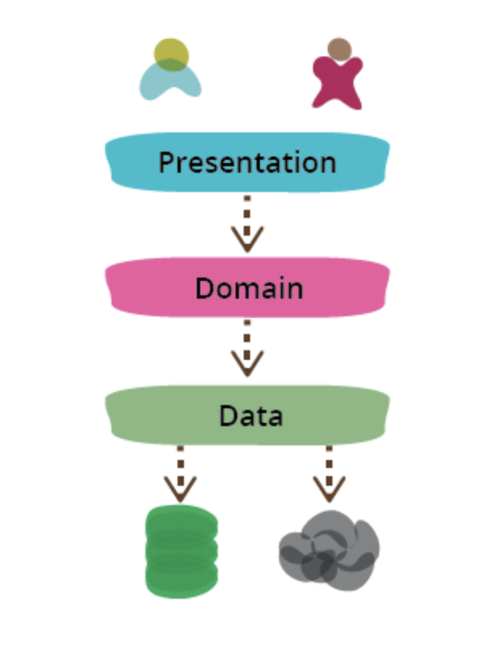

# Project + Logical architecture

From: https://martinfowler.com/bliki/PresentationDomainDataLayering.html

One of the most common ways to modularize an information-rich program is to separate it into three broad layers: presentation (UI), domain logic (aka business logic), and data access. So you often see web applications divided into a web layer that knows about handling HTTP requests and rendering HTML, a business logic layer that contains validations and calculations, and a data access layer that sorts out how to manage persistent data in a database or remote services.

On the whole I've found this to be an effective form of modularization for many applications and one that I regularly use and encourage. It's biggest advantage (for me) is that it allows me to **reduce the scope of my attention** by allowing me to think about the three topics relatively independently. When I'm working on domain logic code I can mostly ignore the UI and treat any interaction with data sources as an abstract set of functions that give me the data I need and update it as I wish. When I'm working on the data access layer I focus on the details of wrangling the data into the form required by my interface. When I'm working on the presentation I can focus on the UI behavior, treating any data to display or update as magically appearing by function calls. By separating these elements I narrow the scope of my thinking in each piece, which makes it easier for me to follow what I need to do.

