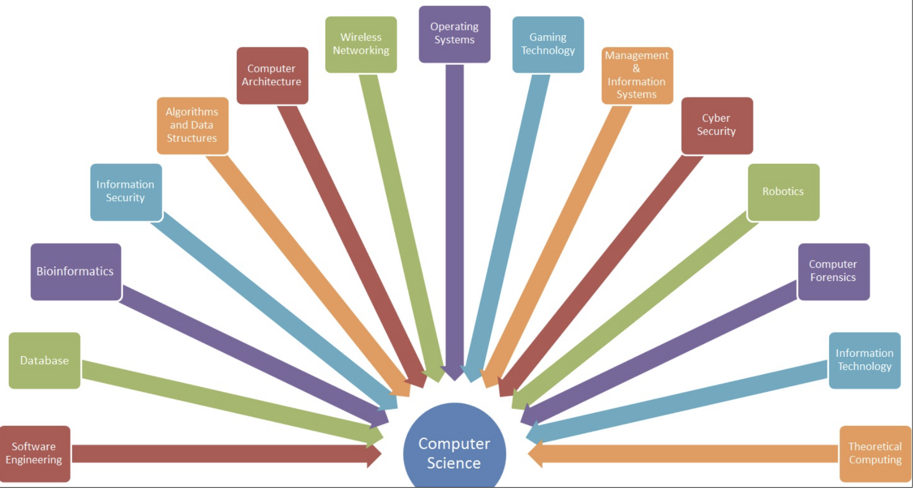
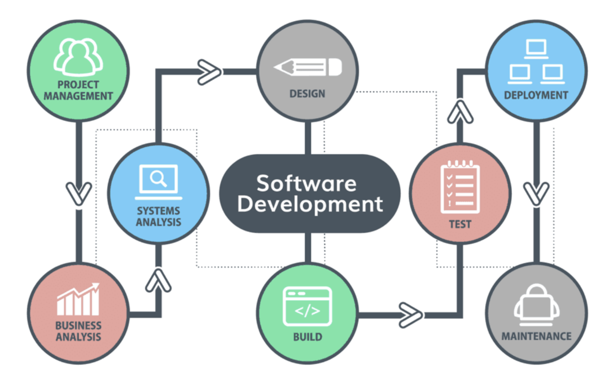
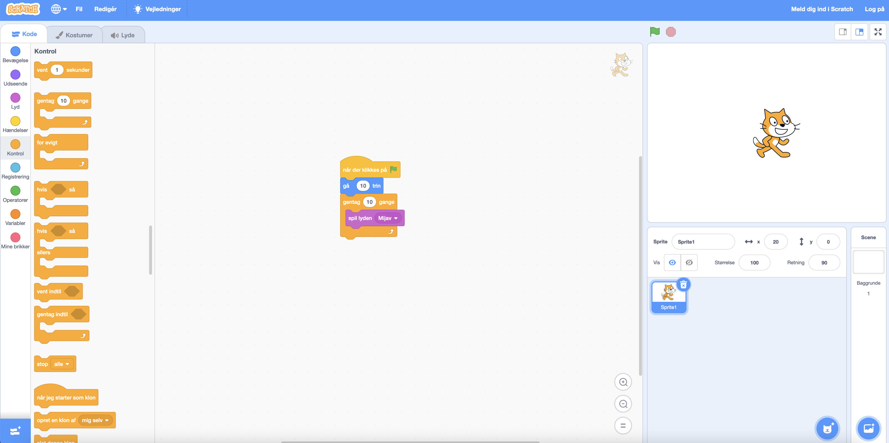
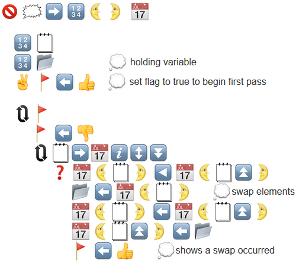
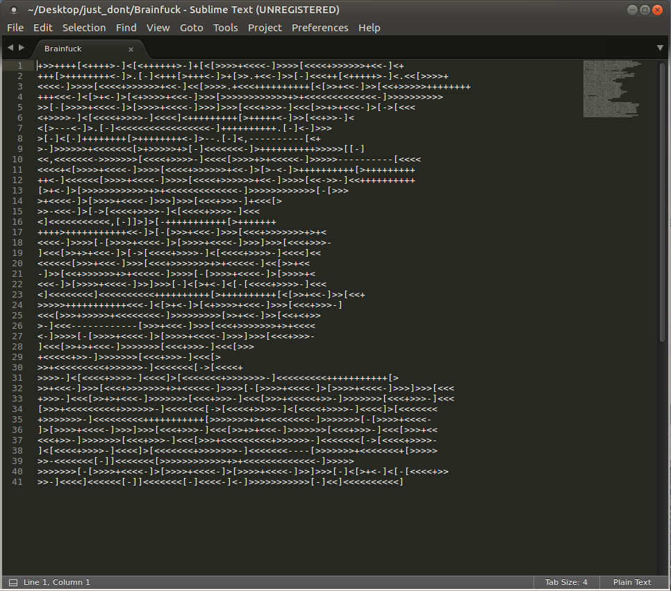
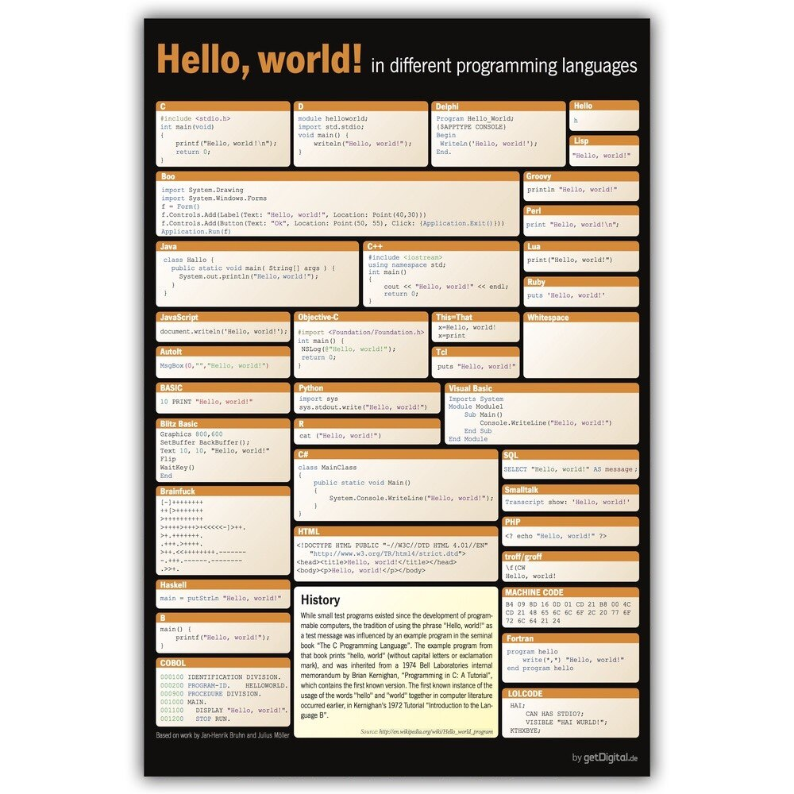
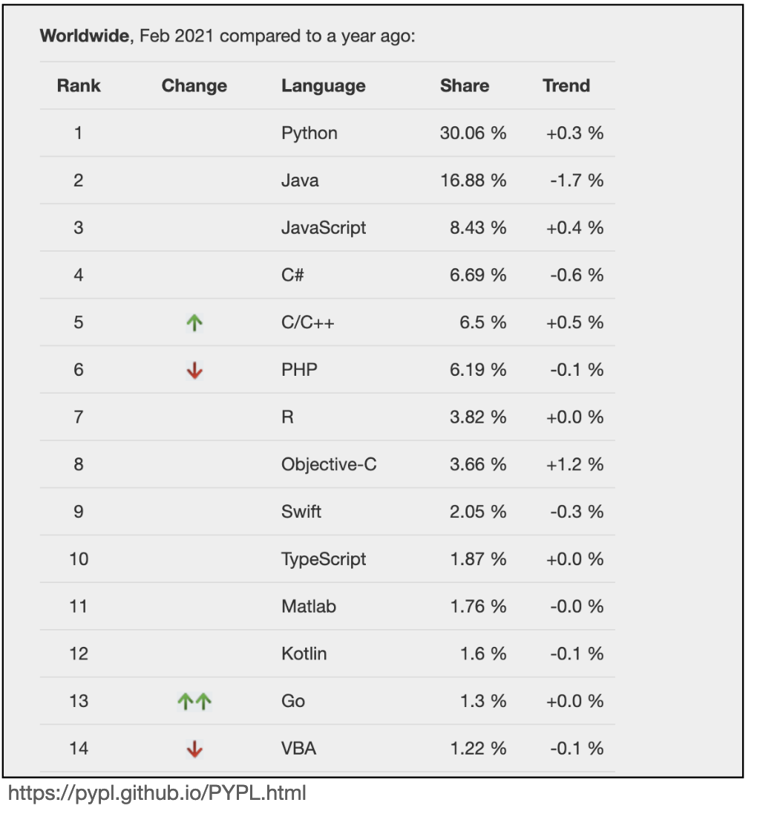

# Tuesday 7/9-2021


## Hvad er Computer science

De mange aspekter af Computer Science




De mange aspekter af at udvikle software




## Hvad er programmering

Programmering er en måde at fortælle en computer hvad den skal gøre. Man skriver nogle instrukser som så bliver sendt til computeren for at køre. Måden man skriver instrukser til computeren er via et programmeringssprog. Det er lidt ligesom at der er mange måder at sige farvel på med forskellige sprog. 


Lad os tage nogle forskellige eksempler 👇

**Scratch**




**Emojicode**




**Brainfuck**







Vi kommer til at arbejde med Java som er et forholdsvis populært



https://www.youtube.com/watch?v=NVuTBL09Dn4

https://www.youtube.com/watch?v=RnqAXuLZlaE


Sådan her ser det ud og alle de mærkelige tegn og ord er det i skal lære over de næste mange uger :)

```java
public class HelloWorld {
    public static void main(String[] args) {
    		System.out.println("Hello world!");
    }
}
```


- [Problem solving](../../topics/01 - introduction/problem-solving.md)

