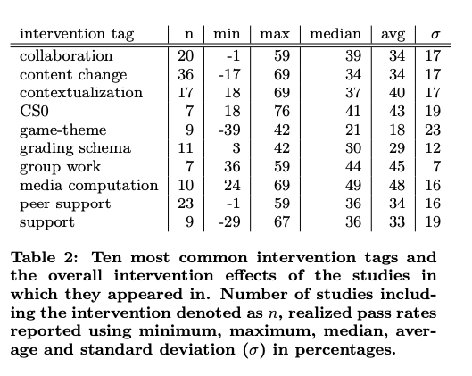

# Takeaways papers

I have read a bunch of papers on what was learned running introductory programming. 

## A systematic Review of approaches for teaching introductory Programming and Their Influence on Success

- But despite yielded promising results there is still no overall understanding as to why many students are able to program, whilst others endlessly struggle.
- WDF-rate - the rate of students that did not withdraw, receive a D-grade2 and did not fail the exam

Ten most frequent tags and the realized gains

- **collaboration**: activities that encourage student collab- oration either in classrooms or labs
- **content change**: at least parts of the teaching material was changed or updated
- **contextualization**: activities where course content and activities were aligned towards a specific context such as games or media
- **CS0**: the creation of a preliminary course that was to be taken before the introductory programming course; could be organized only for e.g. at-risk students
- **game-theme**: a game-themed component was intro- duced to the course, e.g. a game-themed project
- **grading schema**: a change in the grading schema; the most common change was to increase the amount of points rewarded from programming activities, while reducing the weight of the course exam
- **group work**: activities with increased group work com- mitment such as team-based learning and cooperative learning
- **media computation**: activities explicitly declaring the use of media computation (e.g. the book)
- **peer support**: support by peers in form of pairs, groups, hired peer mentors or tutors
- **support**: an umbrella term for all support activities, e.g. increased teacher hours, additional support chan- nels etc.

Top tags:

1. media computation
2. group work
3. CS0
4. Collaboration
5. Contextualisation
6. Peer support
7. Support
8. Content change

### Collaboration and peer support

- co- operative learning was found to yield the largest absolute improvement in CS1 pass rates
- team based learning was found to yield the second largest absolute improvement
- Considering the results of all 14 courses combined, we found that **instructors who applied a collaborative or peer support based intervention generally received the largest improvements in pass rates** when compared to the other groups examined in this study

### Boot strapping

- using visual programming tools were found to yield the fifth largest ab- solute improvement in pass rates

### Relatable Content and Contextualization

- using media computation was found to yield the seventh largest abso- lute improvement in pass rates  14.7%
- and a comparable improvement was found for gamification 10.8%
- However, when considering realized changes, media computation was found to yield the largest realized change across all interventions explored in this study (50.1% increase), whereas gamification was found to only yield the tenth largest (27.4% increase)

### Course Setup, Assessment, Resourcing

Not any great performers here

### Top improvements

1. Cooperative
2. Media computation
3. Team based
4. Scratch and Alice
5. Media computation with pair programming
6. Class size
7. Extreme apprenteiceship
8. Resource improvement
9. CS0
10. Games

The courses with relatable content (e.g. using media computation) with coop- erative elements (e.g. pair programming) were among the top performers with CS0-courses

Whilst there is no silver bullet, no teaching approach works significantly better than others, a conscious change almost always results in an im- provement in pass rates over the existing situation.

## Success in introductory Programming: What Works?

How pair programming, peer instruction, and media computation have improved computer science education.

### Pair programming

Was found to improve student pass rates and more likely to pass the next. BUT no improved scores. 

### Media computation

Using media to learn about these concepts. EG Jon's tool for loops and conditionals. 

### Peer instruction

Also good!

## A Survey of Literature on the Teaching of Introductory Programming

Dårligt paper. Kunne virkelig ikke bruges til noget. 

Schneider [85] agrees with Gries [45] that the targets of an introductory programming course should be problem solv- ing and algorithm development

## Teaching Introductory Programming: A Quantitative Evaluation of Different Approaches

The findings revealed that 

- using a syntactically simple language (Python) instead of a more complex one (Java) facilitated students’ learning of programming concepts. 
- Moreover, teaching problem solving before programming yielded signif- icant improvements in student performance. These two factors were found to have variable effects on the acquisition of basic programming concepts.

## All in all

Create the curriculum that is

- Coorporative/team based/group work/pair programming
- Uses media computation
- Teaches problem solving and algorithmic development
- Peer instrcution
- Varied teaching methods
  - Worked examples
  - Parsons problems
  - Interactive games using Java
  - Making students compute without computing

