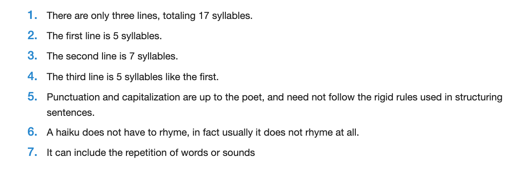

# Haiku Log

###### Github Example: https://github.com/nicklasdean/haiku-app

### Domain presentation

You are building a fully fledged haiku diary with an algorithm that determins  whether a user has inputtet a valid haiku poem or not !

First of all we need to understand what a haiku poem is: 

Next is to analyse how we can translate this into code.

The focus in this project is to write an application that is **layered** in an 3-tier architecture.

- A presentation package - that contains classes that are responsible for interacting with the user
- A domain package that contains classes that are responsible for business logic (Haiku logic)
- A data package that contains classes that are responsible for handling (writing/reading) data

### Technical Requirements:

- All valid haiku poems are stored as either a file or row in .csv
- A Haiku poem has an author and an ID
  - Every time a haiku poem is stored, its ID & author is also stored
- A haiku poem will **not** be stored in the file system if it is **not** a valid haiku poem
  - The user is informed by the presentation layer if a poem is not valid
  - This can be implemented by using **exceptions**
  - (Advanced - optional) An exception could be defined & created for this purpose (Shown in class)
- For the first iteration - A syllable can be defined as:
  - A non repeating vowel
    - 'Steen' is only 1 syllable
    - 'Langeland' is 3 syllables

### Systems design requirements:

**Document** and/or **Design** the system with UML diagrams such that another developer can easily understand the structure and behaviour of the application

#### (Optional) Advanced 

- Add a date and timestamp to each haiku

- A haiku **cannot** include the repetition of words or sounds
- The first words of each haiku line are always capitalized 
- A haiku is saved with ASCII art
- Add an option to print all saved haikus

#### (Optional) Even more advanced

- Each haiku is stored as a beautifully formatted .pdf file (https://www.baeldung.com/java-pdf-creation)

#### Recommended resources:

- https://www.w3schools.com/java/java_files_create.asp
