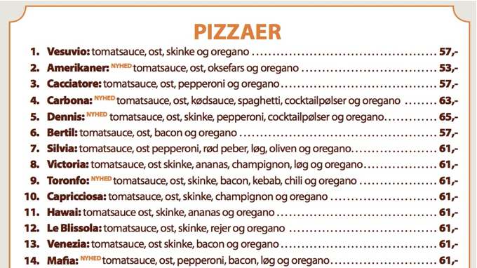

# Marios pizzabar

Mario har en lille pizzabar på Nørrebrogade og sælger pizzaer ud af huset. Han har lidt svært ved at holde styr på ordrerne, og kunne godt tænke sig et system, som en dag kunne blive en online-shop til håndtering af bestillinger. Vi har fået til opgave at hjælpe ham med at lave en simpel løsning i Java. Programmet skal bare kunne køre på hans gamle Dell- laptop, som står i pizzeriaet og ikke er på nettet.

Efter et kort møde med Mario, har vi fået følgende ud af ham:

“Jeg kunne godt tænke mig hele tiden at kunne se en liste med bestillingerne, og hvornår de skal afhentes. Jeg har over 30 forskellige pizzaer, og de fleste kunder ringer og bestiller en times tid i forvejen. Nogle kommer også direkte ind i butikken.

Det ville være rart at have mulighed for at se hele mit menukort på skærmen, så man kan se på det, når der er en kunde i telefonen eller ved disken.

Min nevø, Alfonso, tager imod bestillinger, så han kan indtaste ordrerne. Han tager sig af at betjene computeren. Jeg skal bare kunne se listen over bestillingerne og på en eller anden måde få at vide, hvilken pizza, der nu skal laves. Måske kunne man sortere dem efter tidspunkt. Det kan jeg ikke helt gennemskue. Bare det bliver let for mig.

Når jeg har lavet en pizza, skal jeg kunne råbe til min nevø, når pizzaen er klar. Så kan han fjerne den fra listen, når den er afhentet og betalt. 

Jeg vil gerne kunne gemme alle ordrerne, når de ekspederet. På den måde vil jeg kunne se omsætningen, og senere lave statistik på hvilke pizzaer, der er mest populære.”

## Praktiske oplysninger

1. Opgaven løses i studiegrupper. Alle bør løse en ligelig del af arbejdet.
2. Det er en obligatorisk opgave indeholdende:
   1. Selve programmet (*Arbejd iterativt, dvs. kod én funktionalitet ad gangen)
   2. Domænemodel
   3. Et klassediagram
   4. Et sekvensdiagram
   5. Et systemsekvensdiagram
   6. PowerPoint-præsentation med risikoanalyse og risikoplan over projektet.

## Group work

For this project you have to work in groups! Each group has to handin one solution! You will be judges individually. Therefore **it should be clearly stated who wrote what code!** You can use comments for this.

## Handin

Hand in on fronter here: https://kea-fronter.itslearning.com/LearningToolElement/ViewLearningToolElement.aspx?LearningToolElementId=931634

For the powerpoint and the diagrams. Either upload them to git or simply add them to the handin on Fronter

**Hand in via git before 17-10-2021 23:59!**

## Handin checklist

- Have you tested that the code works?
- Have you written comments to the code?
- Have you thought of a good structure?
- Is the code easy to understand and read?
- Does the variablename make sense?