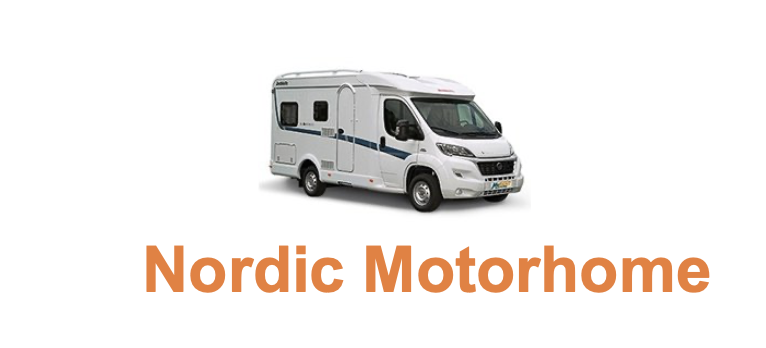

# Nordic Motorhome Rental

#### Inception + Ellaboration activities

In this project you are adviced to work in groups of 2-3

In this project scope you should only do activities related to Systems Design - the main activities in the inception & ellaboration phase of RUP.

You have received the following description from a customer that describes and analyses their business. It is up to you to initiate the first iterations of analysis. Meaning you should provide:

- Vision
- Glossary
- 1 brief use case
- 1 casual use case
- 2 fully dressed use cases
- A System Sequence Diagram representing the main success scenario
- A use case diagram
- A domain model
- (Optional) Conceptual Class Diagram
- (Optional Advanced) A paper prototype or mockup of the main success scenario

All design models should & considerations should be gathered in a single document or github repository.

**Case description**

**Nordic Motorhome**

Nordic Motorhome Rental is a Danish company that rents out motorhomes. Nordic Motorhome Rental was founded in 2019 and is situated just outside Copenhagen. So far there are 8 employees, but the company is very successful, and the two owners expect to hire more people in the near future.

**Employees**: 4 Sales assistants, 2 Cleaning staff, 1 Auto mechanic, 1 Bookkeeper

**The Fleet**

Nordic Motorhome Rental has a fleet of 32 motorhomes available for hire. Nordic Motorhome Rental currently offers 8 different types of motorhomes. These are of various brands and models. Some are small compact campers for 2 persons and others are large with up to 6 beds.

**Prices per day**

The price per day for rent depends on the brand and model of the motorhome.
 Apart from the brand and model price per day also depends upon the season. There are 3 seasons: Peak season, Middle Season and Low season.

In peak season the prices for all motorhomes are 60 % higher than prices in the low season. In middle season the prices for all motorhomes are 30 % higher than prices in the low season.

- The price per day includes 400 free kilometers per day.

- Insurance is included in the price.

- External cleaning is included in the price.

  **Pick-up and drop-off points**

  Nordic motorhome rental offers delivery of motorhomes to a location that is most convenient for the customers. It is often an airport, but it can be any other location for instance a ferry port or a hotel. For pick-up or drop-off outside Nordic motorhome Rentals office, customers will be charged a transfer cost of 0,70€ per kilometer.

  **Extras**

  To make the trip more enjoyable customers can rent accessories such as bike rack, bed linen, child seat, picnic table and chairs etc.

  **Fuel & driven kilometers**

  When customers picks-up the motorhome the tank is full. By drop-off the staff checks the fuel level and reads kilometers of the speedometer. If the tank it is less than 1⁄2 full there will be a charge of 70€. If it turns out that the customer in average has driven more than 400 kilometers per day the customer will be charged 1€ per extra kilometer.

  **Cancellation**

  In case of cancellation following charges become due:

- Up to 50 days prior to the start of the term of rental: 20% of the rental price, minimum 200€
- Between 49 and 15 days prior to the start of the term of rental: 50% of the rental price
- Less than 15 days prior to the start of the term of rental: 80% of the rental price
- On the day of renting: 95% of the rental price

**Service and repairs**

After drop-off the Motorhome will be cleaned. The auto mechanic checks oil & water etc. If repairs or further service is needed the auto mechanic register this.