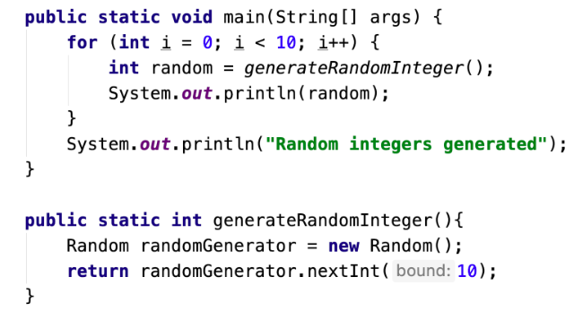

# Mandatory

This mandatory consists of a set of smaller tasks and a little written work. You will have time to work on this in class.

All work should be commited to a Github Repository & handed in as 1 link. 

**Exercise 1**

In 250 words or less:  In your own words - describe the concept and mechanisms used in inheritance 

**Exercise 2**

Write a small program that exemplifies the concept of inheritance. Comment the program accordingly to describe your example. You should use real-life concepts as classes in the program. 

**Exercise 3**

Write a program that reads a file with *n* number of strings separated by linebreaks.  

The program prints how many words are in the file

**Exercise 4**

The U.S. Census Bureau projects population based on the following assumption:

- One birth happens every 7 seconds
- One death happens every 13 seconds
- The population of the USA is currently: 331,002,651.

Write a program that calculates how the US population are projected to be in 5 years.

Print the growth & sum

**Exercise 5**

In your own words - explain the following program in 250 words or less.

**Exercise 6**

Write a program that constructs an arraylist containing the numbers 1 to 100, and prints them out.

The program ask the user for a number and remove all multiples of that number (except for the number itself) from the list.

- Print the list again.

For example, if the user selects 5, it will remove 10, 15, 20, 25, 30, etc from the list.

**Exercise 7**

In 250 words or less: explain the concept of the "static" keyword. You can use a code example.