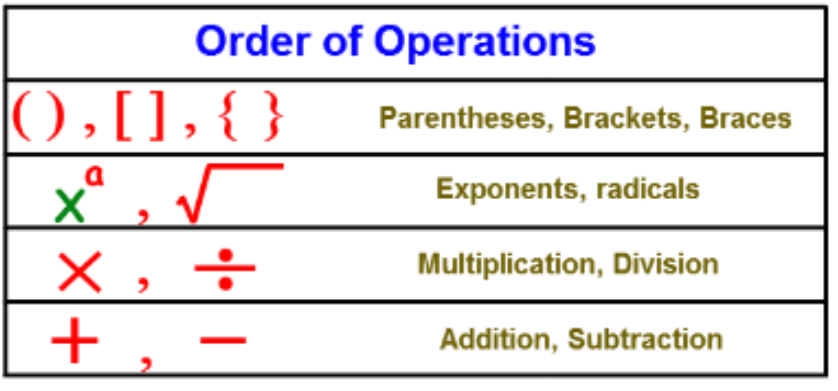
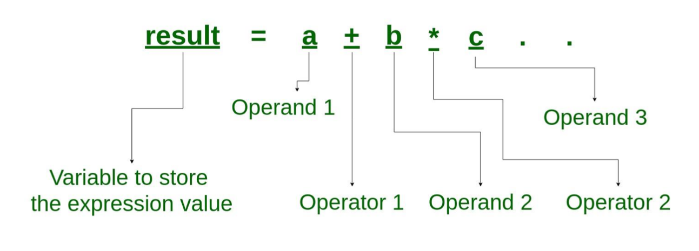

# Expressions


> An expression is a simple value or a set of operations that produce a value


The simplest expression is just a value fx `55.9` but if we go a bit more advanced we can do things like addition:

```java
3 + 5
```

Here `+` is called the operator. Lets take a look at some more operators


## Arithmetic Operators

- `+` - Addition
- `-` - Subtraction
- `*` - Multiplication
- `/` - Division
- `%` - Modulus


## Order op operations




## More complex expressions

It is possible to create more complex expressions:

````java
result = 3 * 5 / 5 + 1
````





**In what order will Java calculate these expressions?**

```java
int result = 100 * 100 / 5 + 200 * 3 / 2;
double result = radius * 3.14 * 0.1;
double profit = salesPrice - purchasePrice * 0.8;
int result = 2 + 3 * 4 + 10 / 5 * 2 – 1 + ;
int modulus = 10 % 3;
```


## Relational operators

- `==` - Equality
- `!=` - Non equality
- `>` - greater than
- `<` - less than
- `>=` -  Larger than or equal
- `<=` -  Less than or equal


## Logical Operators

`&&` - Logical and

`||` - Logical or


