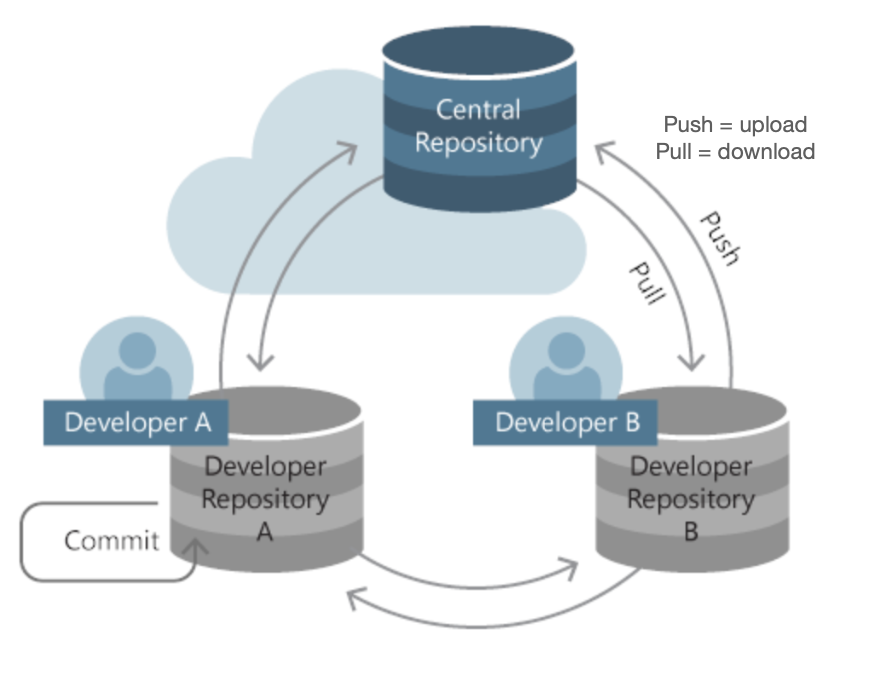
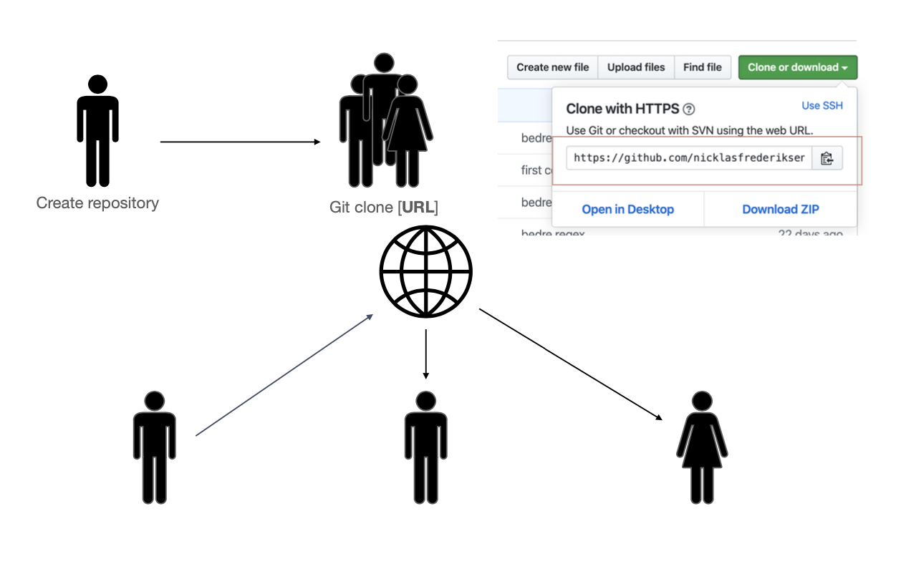

# GIT

Today we will be learning git which is a tool for collaborating on code and other projects. It makes it easy to work multiple people on the same project.

## Learning goals

- Understanding the git versioning ecosystem 
- Installing git
- Creating repositories
- Commit / Add / Pull / Push
- CodeWithMe > Git for collaboration

## Git != Github

- **Git** is a versioning / Source Control Management (SCM) tool developed by Linus Torvalds

- “*I really never wanted to do source control management at all and felt that it was just about the least interesting thing in the computing world (with the possible exception of databases ;^), and I hated all SCM’s with a passion*” - Author of the Linux kernel

- Command Line tool to version & share codebases, built on the concept of repositories
- Repository = Code project

## Github

- Online service that serves as remote repository for git repositories 
- Acquired by Microsoft $7.5B
- Explore open source code
- Host to deploy simple web-applications
  - Portfolios: https://benna100.github.io/portfolio/
  -  Git-books: https://behu.gitbook.io/java-first-semester/ External drive for text / files

## Why?

- Share code base between developers / stakeholders 
- Work distributed on a code base at the same time by:
  - Avoiding overwriting work done by others
  - Keep one source of truth Keep a version history

## A world without version control

- Sending files over email/Facebook/whatever
- What happens when two developers have changed the same code?
- What is the newest version `projectA_newest_1_new_old_new.java`

## Basic concept

## Initialising a repo

### Comparison with saving a word document

Let's first start with an analogy: Saving word documents

1. You first make som changes that you would like to save
2. Now you press `ctrl` + `s` and save a word document. This is saved locally on your own computer
3. You can now take the document and sync to the cloud (save to the cloud)

Hold these three steps in your head for later!

## Working with git in the terminal

### Initialising your repository

First you initialize a project on GitHub. Now you need to clone the project to your computer using the command `git clone GITHUB_REPO_LINK`

### Adding a file to your repo

Now you have a repo locally on your computer, now you can start to add files to it.

### `git status`

`git status` - shows you a status of your repository

When doing `git status` you will be able to see the changes that you have made to a repository. This is like the first step in the word analogy: making some change that we would like to save

### `git add`

`git add login.java` - will add the changes in the `login.java` file

If we compare this to our word analogy. Imagine if we could make changes to a word document and decide which changes we would like to save. Fx save the changes where i added this header and that link. Instead of saving everything. 

This is what `git add` does. You specify which changes you would like to save. In this case we add all the changes in the file called `login.java`

### `git commit`

Now continuing with the word analogy, what if we could give the things we wanted to save a name. Fx save the changes i did where i wrote the intro and added the image and call this save `wrote introduction`

This is what is done with `git commit`. More specifically we say

`git commit -m "Added login features"` 

This means:

- Commit all the change i added in the `git add` command (all the changes that i wanted to save)
- Give the commit a name called `Added login features`
- Commit all the changes that we said the `git add` command (adding the `login.java` file)

### `git push`

Now we have want to take the commit containing the `login.java` file and push it to the cloud (GitHub.com). This we do with `git push`.

This is like step 3 in the word analogy

More specifically we say:

`git push origin master`

It means 

- Push all the commit we have created
- Push it to the url `origin` (this is a shortcut for your repo link)
- `master` means push the changes on the `master` branch (you will learn about this later!)

