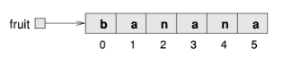
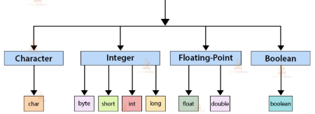
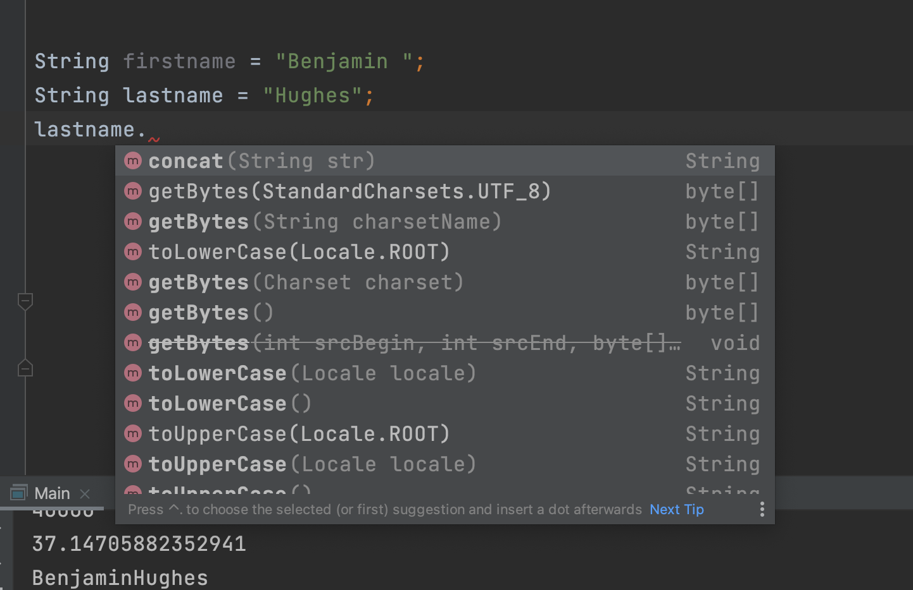

# Strings

A string is a data type used for handling text. Strings are always sourrounded by double quotes. Here is an example:

```java
String fruit = "banana";
```


The way a string is built up is as a sequence of characters. So the first character in `fruit` is `b`, the second character is `a` and so on. *In programming languages the first element has index 0 (which is a bit weird in the beginning)*



That means that if we wanted the first character in a string we would get that at index 0!

```java
char firstCharacter = fruit.charAt(0);
System.out.println(firstCharacter); // prints b
```


String are different than the types we saw when working with `int`, `double` or `char`. `String` is called non primitive/complex data type. Lets get into the differences between primitive and non-primitive


## Primitive data types

There are 8 primitive data types in java as you can in the figure below. Primitive data types is predefined by its language and **holds the value of a variable directly in memory**! 





## Complex data types

This types has many names, it's also called reference types or complex types. Here the value of the some variable is not held in memory. **Instead a reference to the object is held in memory**!

There are some more differences that you will learn later. But one thing that is relevant now is that a `String` has methods that can be called on them. 

To call a method on a `String` write `.` and then the method you want to call. Here is an example

```java
String name = "Benjamin";
String upperCaseName = name.toUpperCase();
System.out.println(upperCaseName) // prints BENJAMIN
```


IntelliJ will autocomplete with methods when pressing `.` after a string variable as can be seen below



To find more methods see here: https://www.w3schools.com/java/java_ref_string.asp


Lets see some more examples

```java
String lastname = "Hughes";
lastname.toUpperCase(); // HUGHES
lastname.charAt(2); // g
lastname.length(); // 6

//We can even add strings together:
String firstname = "Benjamin ";
String lastname = "Hughes";
String fullname = firstname + lastname;
System.out.println(fullname); // Benjamin Hughes
```


## Exercises


### Exercise 1

In a group investigate two different string methods. You need to be able to explain what the method does but also how to use it in Java!

A couple of groups will be selected to show what they learned


### Execise 2

- Convert string to uppercase
- Return the index of a character
- Concatenate two different string
- Compare a string to another string ignoring case. 
- Test if the string ends with a certain character


### Exercise 3 

Løs de her opgaver: https://www.w3resource.com/java-exercises/string/index.php


## Homework

1. Skriv en klasse der hedder Kage, med en main-metode, gem, compiler og kør (intet sker!). 

2. Gå på nettet og find en kageopskrift – frit valg af yndlingskage 

3. Lav en variabel for hver af ingredienserne i kagen, med et passende navn og type (fx `int gramSugar`,  `int teaspoonsVanilla` eller `int numberOfEggs`)

4. Tildel variablene den værdi der er i opskriften (fx `int gramFlour = 250;`) 

5. Udskriv hver af variablene pænt ovenover hinanden så det ligner en opskrift, a la: 

```
Sukker 200 g
Mel 250 g
```

6. Lav en variabel der hedder `totalIngredientsGrams`. I alle efterfølgende opgaver laver du variable efter behov, som du selv navngiver meningsfuldt. 

7. Regn ud hvor meget alle ingredienser i kagen vejer tilsammen (hvis det er skefulde, så søg på nettet hvor meget en skefuld af ingrediensen ca. vejer, eller gæt!) og tildel denne værdi til `totalIngredientsGrams`. 

8. Udskriv variablen `totalIngredientsGrams`, samt en lille forklaring på hvad tallet betyder (fx ”Ingredienserne til kagen vejer 740 gram”, hvor 740 er værdien af variablen). 

9. Vi regner med at en færdigbagt kage vejer 10 % mindre end ingredienserne – hvor meget vejer den færdige kage? Udskriv resultatet af beregningen. 

10. Gå på nettet og find en energifordeling for hver af ingredienserne (dvs hvor mange gram protein, kulhydrat osv. pr 100 g, og hvor mange kalorier ). 

11. Udregn og udskriv hvor mange gram protein der er i hver ingrediens i den mængde kagen indeholder, med en lille forklaring, som fx `Protein fra æg: 23 g`

12. Udskriv hvor mange gram protein der samlet er i kagen. 

13. Find energifordelingstabellen igen, og beregn hvor mange kalorier der er i hver ingrediens i kagen, i den mængde der er brugt (kalorier i tabellen er typisk angivet i kalorier pr 100 gram). Udskriv resultatet af beregningen, fx ”Energi fra sukker: 146 kcal”. 

14. Hvor mange kalorier er der i alt i kagen? Udskriv resultatet af beregningen. 

15. Søg på nettet hvor meget hver ingrediens koster (fx en bakke med 10 æg, 22 kr). Beregn pris pr ingrediens i den mængde der bruges i kagen (fx giver 2 æg 4,4 kr). Beregn kagens samlede pris og udskriv resultatet. 

