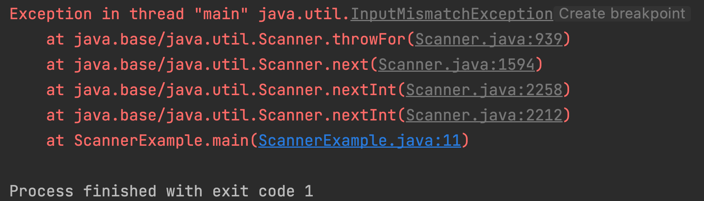

# Workin with inputs


Most software programs need to take some kind of input from the user. Maybe its the users name, age og the number of search results the user want to see. In Java we can also get input from the user. So lets learn how that works:


## `Scanner` class

The `Scanner` class is used to get inputs from a user. 

Here is a program that asks for a users name and then outputs that to the console

```java
import java.util.Scanner;  // Import the Scanner class

class Main {
  public static void main(String[] args) {
    Scanner scanner = new Scanner(System.in);  // Create a Scanner object
    System.out.println("Enter name");

    String name = scanner.nextLine();  // Read user input
    System.out.println("Name is: " + name);  // Output user input
  }
}
```

So `import java.util.Scanner;` this line will import the package so that we can work with the `Scanner` class

`Scanner scanner = new Scanner(System.in); ` will create a scanner that we can work with. Don's worry about the `new` keyword you will learn that later. 

`String name = scanner.nextLine();` This line will ask the user to input some text in the console. That means that the program actually stops executing before the user has written some text and pressed enter. Now what the user has written will be assigned to the variable `name` that then will be logged out. 


## Scanner types

There are different methods for getting data from the user. In the example above we user `scanner.nextLine()`. But we can specify which type we expect. Here are some examples:

- `scanner.nextInt()`
- `scanner.nextDouble()`
- `scanner.nextInt()`


Now what do you think happens when a user writes some text but the input that was expected was an `integer`? Then Java will throw an error: 



Here Java is throwing the `InputMismatchException` error. So Java is telling us that there is a mismatch between the expected type of the input (an `int`) and the actual type of the input (a `String`)


## Exercises


