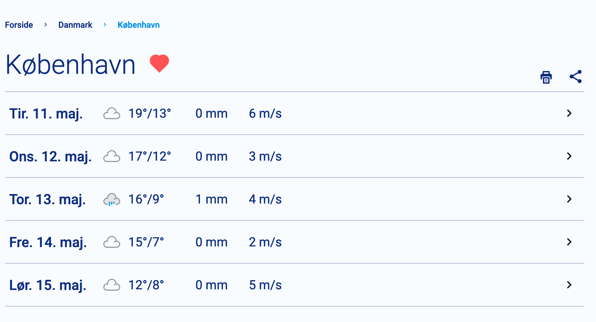
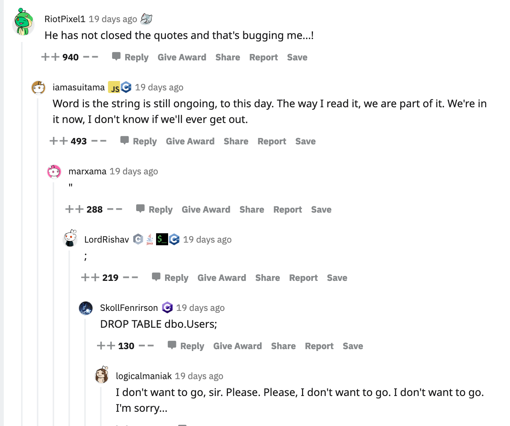
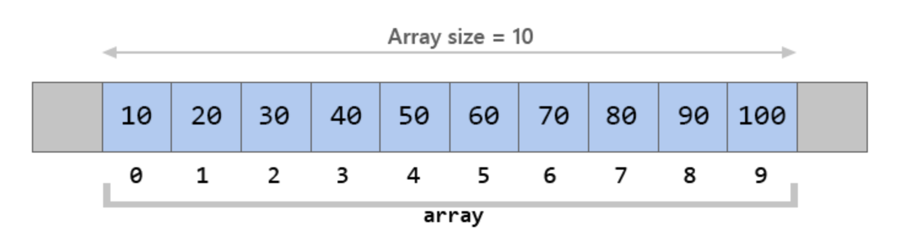

# Array

Watch this video as support 👇

https://youtu.be/ohrYtVa0CgM


Arrays are used to store multiple elements. It can be seen as a list of things (in Java talk: an array of elements). Arrays are incredibly versatile and used everywhere. Here are a few examples


**List of days with weather information**




**List of comments on a reddit post**




**An list of clothes to pack**


Behind the scenes all these lists are powered by arrays

Enough intro for now, lets get to the meat and potatoes!


## Working with arrays in Java

Let's say we want to store an array of names. In Java that would look like this:

```java
String[] names = {"Camilla", "Per", "Cecilie", "Marie"};
```

- `String[] names` - Create an array of Strings with the name `names`
- `{"Camilla", "Per", "Cecilie", "Marie"};` - Here we define what elements should be stored in the array


The way an array works is by saving the individual elements at specific index's. The first element is saved at index 0, the second element is saved at index 1 and so on. If you think it's a bit weird that the index starts at 0, then you are not alone 👇


Let's try and create an integer array

```java
int[] numbers = {10, 20, 30, 40, 50, 60, 070, 80, 90, 100};
```

We can see that array represented below



So if you want the fifth element in the array you have to get the element at index 4! Another thing to see is the size on the array is 10, because there are 10 elements in the array


### What can be stored in arrays?

Any type in java can be stored in an array, both primitive and complex data types. 


### Accessing elements in the array

Continuing with the array called  `numbers` and `names`, lets see how we can get a specific element at a index in Java:

```java
System.out.println(numbers[4]); // 50
System.out.println(names[1]); // Per
```


### Setting elements in the array

It is also possible to change the value at a sepcific index

```java
System.out.println(numbers[4]); // 50
numbers[4] = 77;
System.out.println(numbers[4]); // 77
```


### Length

To get the number of elements in an array write the following:

```java
System.out.println(names.length); // 4
```


### Creating array with set number of elements

```java
int[] numbers = new int[10];
String[] strings = new String[9];
```

Here we are first creating an array `numbers` with 10 elements. Afterwards we create an array `strings` with 9 elements. But the array have nothing in them yet

>  The elements in the array allocated by *new* will automatically be initialized to **zero** (for numeric types), **false** (for boolean), or **null** (for reference types)


### Real world example of arrays

```java
String[] loggedInUsernames = {"dankStar", "pizzaLover", "PizzaCrustLover", "banana_boat"};
// Save number of logged in users in a new variable
int loggedInUsers = loggedInUsernames.length;
System.out.println("there are " + loggedInUsers + " logged in users");
// We get the last element in the array by subtracting 1 from the number of elements in the array 
// Because we start the index at 0!
System.out.println("The last user that logged in is " + loggedInUsernames[loggedInUsers - 1]);
```


## Exercises

After two hours peer instruction!


### Exercise 1 - iterating through an array

Iterating through the loop means running through each element in the array and doing something with those elements. 


Find a partner group. One groups investigates iterating through an array using a `for` loop another group investigates iterating through an array using the for each loop

You have 30 minutes to prepare a presentation for the other group explaining the iteration type you got. When preparing focus on these things

- How does your iteration type work?
- Write a practical code example of how to use the iteration type you got
- In what situations should someone use the iteration type you got?

The presentation should be around 5-10 minutes. Have the presentation as you like. If slides works for you then use that, if just code works for you the use that, if a document is better then use that. 


### Exercise 1.2

Figure out what this method does **without running it!**

- For each line make a comment that describes these things: You can read more about describing your programs [here](https://github.com/hackyourfuturebelgium/welcome-to-js/tree/master/describing-programs)

  ```
  // what code is written in line of the program?
  //  why is this line of code here?
  //  what variables does it use?
  //  how does it relate to other lines?
  //  ... anything else you notice?
  ```

- Improve the variable names so they make more sense for you
- When you have figured out what the method does, give the method a better name
- Also show an example of how to use the method

```java
static char[] doSomething(char abc[]) {
    char[] bac = new char[abc.length];
    int j = abc.length;
    for (int i = 0; i < abc.length; i++) {
        bac[j - 1] = abc[i];
        j = j - 1;
    }

    return bac;
}
```


### Exercise 1.1

Solve the 2 first exercises in Array-1 from CodingBat: https://codingbat.com/java/Array-1

- firstLast6
- commondEnd


### Exercise 1.2

```java
String[] names = new Array(){"Peter", "Sarita", "Jens", "Julie", "Jens"};
```

Remove names that is `Jens` 

Use a normal for loop to remove all Person with first name Jens from the above list.


### Exercise 2

Write a method that takes two parameters:

- An array of Strings
- An integer `n` 

The method prints the String on the *nth* index.

Here is an example of how to use the method:

```java
String[] names = {"Camilla", "Per", "Cecilie", "Marie"};
String exercise2Result = exercise2(names, 3);
System.out.println(exercise2Result); // Marie
```

*Remember good variable and function names! Dont use the ones in the above example*


### Exercise 4

Write a method that takes a single parameter:

- An array of integers

The method returns the lowest value from the array


### Exercise 5

Lav en metode, der tager en String som parameter og udskriver hvor mange ord strengen består af. 

Eksempel: Hvis metoden kaldes med denne tekst fra main: 

 ```java
 findNumberOfWords("Der var engang");  
 ```

skal svaret være 3, fordi der er tre ord i strengen adskilt med mellemrum.  

Hint:  

Tænk over hvad der karakteriserer en streng med to ord. Hvordan ved i at der er to ord? Måske i kan skrive noget kode der kan gøre brug af det!


### Exercise 6

Skriv en metode der kan finde og returnere antal strenge, som  indeholder en bestemt bogstavssekvens i et String array. Metodens  signatur skal se således ud: 

```java
public static int findAntal(String[] liste, String sekvens)  
```

Parameteren kaldet sekvens repræsenterer en bogstavssekvens, som der skal ledes efter i arrayet kaldet liste. 

```java
System.out.println(findAntal("banan", "an")); // 2
System.out.println(findAntal("hahaha", "ha")); // 3
```


### Exercise 7


### Exercise 8

Write a Java program to compute the average value of an array of integers except the largest and smallest values.


### Exercise 9

.Write a Java program to check if the sum of all the 10's in the array is exactly 30. Return false if the condition does not satisfy, otherwise true


### Exercise 10

Write a Java program to remove the duplicate elements of a given array and return the new length of the array.

Sample array: `[20, 20, 30, 40, 50, 50, 50]`

After removing the duplicate elements the program should return 4 as the new length of the array.


### Exercise 11

Write a Java program to print all the LEADERS in the array. 

Note: An element is leader if it is greater than all the elements to its right side

