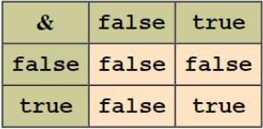
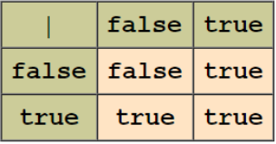
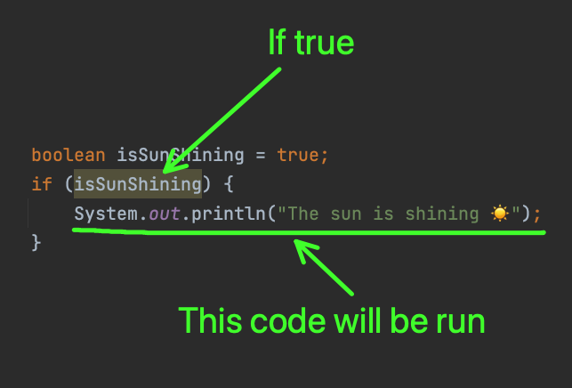
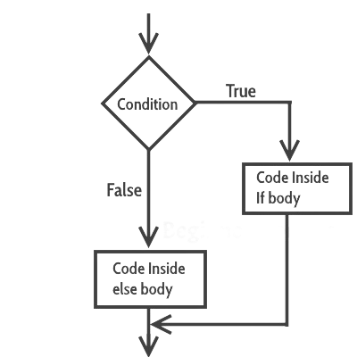

# Conditionals and boolean

Conditionals is a way for a computer to handle decisions. Given some condition the program should be able to account for that. This is done using something called a conditions conditional statement. 


## Boolean

A boolean is a Java type that stores either `true` or `false`. 

An real world example of a boolean element is a checkbox like in the image below


The `Husk mig?` checkbox can either be checked (`true`) or unchecked (`false`)


Let's move into Java 👇

Lets say we want to create a `boolean` variable that stores the value of the checkbox above. We would do that like this:

````java
// here we declare the variable rememberMe as a boolean 
//and assign the value of false (because the checkbox is unchecked)
boolean rememberMe = false;
````


We could also store a boolean indicating if the sun is shining today:

```java
// here we declare the variable isSunShining as a boolean
// depending on the weather we either set it to true or false
// lets say the sun is shining
boolean isSunShining = true;
```


## Relational operator

What if we had a variable called `televisionPrice` that we wanted to check was expensive. We could fx say that prices larger than 10.000 is an expensive price. In Java we would do that like this:

```java
int televisionPrice = 12000;
boolean isTelevisionExpensive = televisionPrice > 10000;
// > reads as "is larger than"
System.out.println(isTelevisionExpensive); // true
```


There are 6 different relational operators

- `x == y` - `x` is equal to `y`
- `x != y`  - `x` is not equal to `y`
- `x > y` - `x` is greater than `y`
- `x < y` - `x` is less than `y`
- `x >= y ` - `x` is greater than or equal to `y`
- `x <= y` - `x` is less than or equal to `y`


**This is perfect for something like peer instruction!!!**

Exercise possibility

a person is higher than 2 meters. So this means 


## Logical operator

There are different logical operators we can use

- `&&` - And operator
- `||` - Or operator


### And operator

And operator evaluates to `true` if both the expression to the right 👉 **and** 👈 the left of the `&&` is `true`. If **one of them** is `false` the expression will be `false`

Here is a table showing and values




```java
boolean a = true && true;
System.out.println(a); // true
boolean b = false && true;
System.out.println(b); // false
boolean c = false && false;
System.out.println(b); // false

// more real world example
boolean isOwner = true;
boolean isLoggedIn = true;
boolean canEdit = isOwner && isLoggedIn;
System.out.println(canEdit); // true
```

For the real world example. Imagine we as developers need to check if a developer can edit some document. We might make a check as the one shown above


### Or operator

Or operator evaluates to `true` if the expression to the right 👉 **or** 👈 the expression to the left of the `||` is `true`. If **both** of them are `false` the expression will be `false`

Here is a table showing or values




```java
boolean a = true || true;
System.out.println(a); // true
boolean b = false || true;
System.out.println(b); // true
boolean c = false || false;
System.out.println(c); // false

// more real world example
boolean isOwner = false;
boolean hasAccess = true;
boolean canEdit = isOwner || hasAccess;
System.out.println(canEdit); // true
```


## Exercises


## Conditional statements

Conditional statments is the mechanism for which a computer takes decisions. The most typical conditional statement is a **if sentence**. Lets look at an example


### If sentence

```java
boolean isSunShining = true;
if (isSunShining) {
  System.out.println("The sun is shining ☀️");
}
```

Here we first define the `boolean` variable `isSunShining` to be `true`. Then we comes the if sentence. Only if `isSunShining` is `true` the code within the brackets (`{}`) will be executed. 





### If else sentence

But what if we wanted to print something else if the sun it **not** shining? For that we add an `else`:

```java
boolean isSunShining = false;
if (isSunShining) {
	System.out.println("The sun is shining ☀️");
} else {
	System.out.println("The sun is not shining 🌧️");
	System.out.println("Oh no ☹️");
}
```

*Try on [Pythontutor](http://www.pythontutor.com/java.html#code=public%20class%20YourClassNameHere%20%7B%0A%20%20%20%20public%20static%20void%20main%28String%5B%5D%20args%29%20%7B%0A%20%20%20%20%20%20boolean%20isSunShining%20%3D%20false%3B%0A%20%20%20%20%20%20if%20%28isSunShining%29%20%7B%0A%20%20%20%20%20%20%20%20%20%20System.out.println%28%22The%20sun%20is%20shining%20%E2%98%80%EF%B8%8F%22%29%3B%0A%20%20%20%20%20%20%7D%20else%20%7B%0A%20%20%20%20%20%20%20%20%20%20System.out.println%28%22The%20sun%20is%20not%20shining%20%F0%9F%8C%A7%EF%B8%8F%22%29%3B%0A%20%20%20%20%20%20%7D%0A%20%20%20%20%7D%0A%7D&cumulative=false&heapPrimitives=nevernest&mode=edit&origin=opt-frontend.js&py=java&rawInputLstJSON=%5B%5D&textReferences=false)*

Now when `isSunShining` is `false` the code within the brackets after the `else` will be executed. 


Here is a flow diagram showing how if-else sentence works:




### Else if

What if we wanted to take decisions based on more that just `if` or `else`? For that we need and `else if` sentence. Here is an example

```java
int age = 23;
if (age < 16) {
	System.out.println("You cannot buy any alcohol ✋");
} else if(age > 16 && age < 18) {
	System.out.println("You can now buy beer 🍺");
} else {
	System.out.println("You can now buy all alcohol 🍹");
}
```


## Real world example

Lets create a more real world example before moving on to exercises

```java
int userAge = 13;
int accountAmount = 100;
// Lets say this comes from the user
int accountToWithdraw = 50;
boolean canUserWithdraw = accountAmount - accountToWithdraw > 0;

if (userAge >= 13 && canUserWithdraw) {
    System.out.println("Withdrawing " + accountToWithdraw + " dollars 💵");
} else {
    System.out.println("Sorry you cannot withdraw any money");
}
```

*Try on [Pythontutor](http://www.pythontutor.com/java.html#code=int%20userAge%20%3D%2013%3B%0Aint%20accountAmount%20%3D%20100%3B%0A//%20Lets%20say%20this%20comes%20from%20the%20user%0Aint%20accountToWithdraw%20%3D%2050%3B%0Aboolean%20canUserWithdraw%20%3D%20accountAmount%20-%20accountToWithdraw%20%3E%200%3B%0A%0Aif%20%28userAge%20%3E%3D%2013%20%26%26%20canUserWithdraw%29%20%7B%0A%20%20%20%20System.out.println%28%22Withdrawing%20%22%20%2B%20accountToWithdraw%20%2B%20%22%20dollars%20%F0%9F%92%B5%22%29%3B%0A%7D%20else%20%7B%0A%20%20%20%20System.out.println%28%22Sorry%20you%20cannot%20withdraw%20any%20money%22%29%3B%0A%7D&cumulative=false&heapPrimitives=nevernest&mode=edit&origin=opt-frontend.js&py=java&rawInputLstJSON=%5B%5D&textReferences=false)*

Can you think of an example using if, else if, else?


## Exercises


## Exercise 1 - switch and ternary

Find a partner group. One groups investigates switch while the other investigates ternary expression. 

You have 30 minutes to prepare a presentation for the other group explaining either switch or ternary When preparing focus on these things

- How does the conditional work that you picked?
- Write a practical code example of how to use what your group picked
- In what situations should someone use what you picked?

The presentation should be around 5-10 minutes. Have the presentation as you like. If slides works for you then use that, if just code works for you the use that, if a document is better then use that. 

