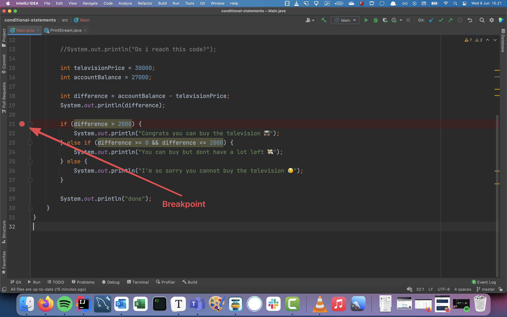
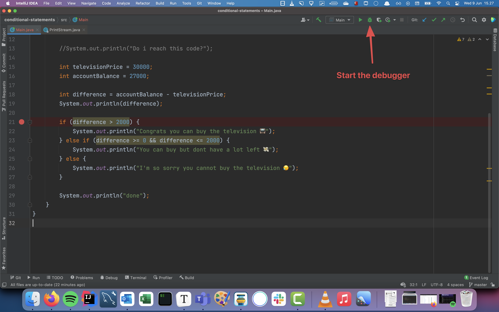
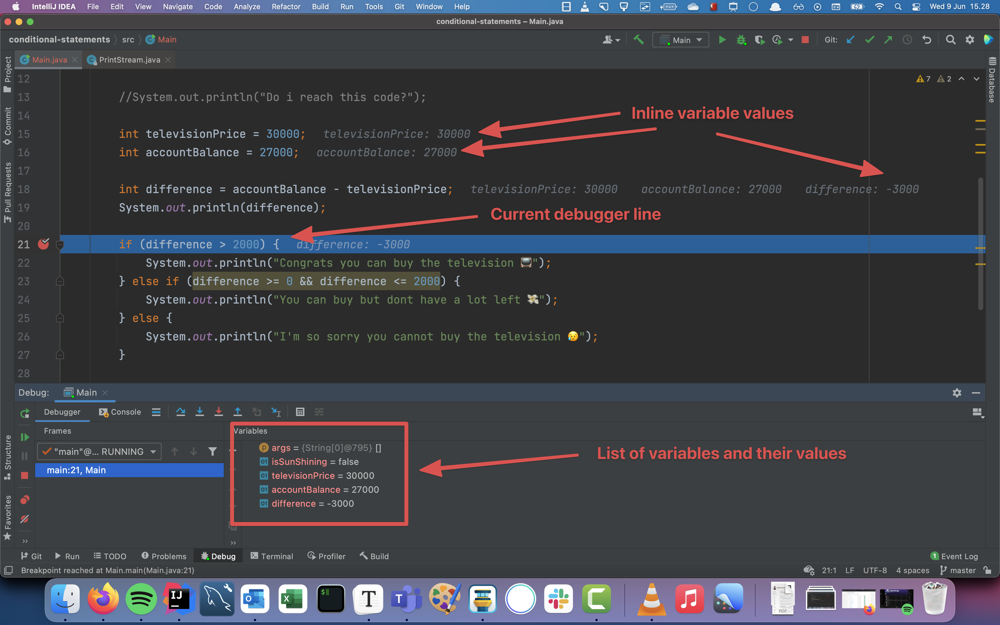
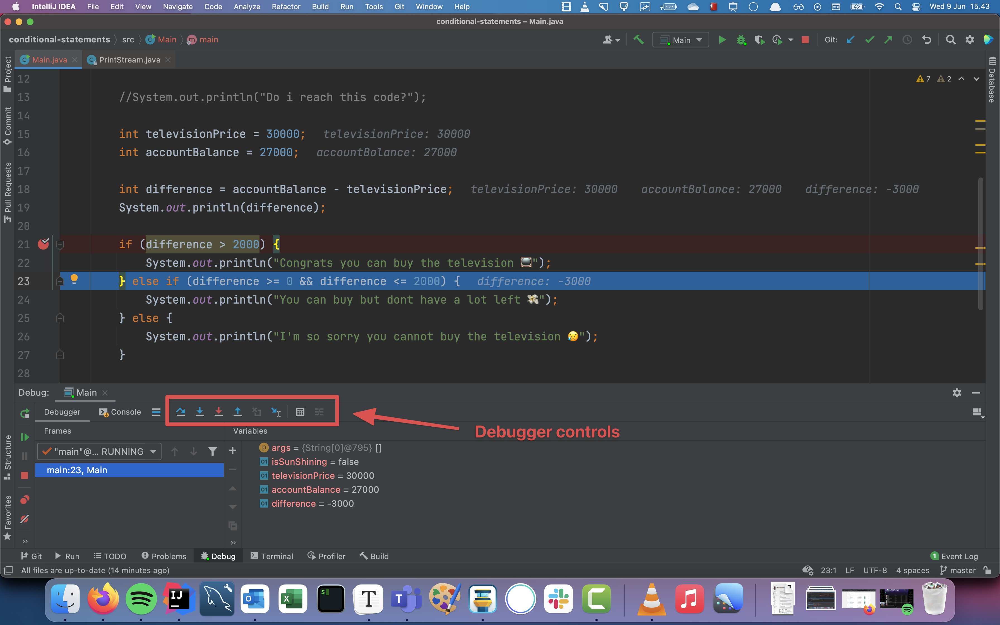
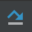
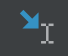

# Debugging

Developing software can sometimes be extremely frustrating. You maybe have an error and you dont understand why. Debugging is the process of fixing error systematically. Developers spend probably 80% on debugging and 20% on actual development. 

Lucikly IntelliJ has some tools that can help us with the process!

## IntelliJ debugger

The Debugger is a tool that can help understanding your code. It works by indicating a place or multiple places in the code you want the code to stop and figure out what the values of our variables are. These places are called breakpoints. 

### Setting a breakpoint

To set a breakpoint in IntelliJ click to the right of the line number. Now a red dot should appear

### Starting the debugger

Next to the green play icon that runs your code, there is a small little green bug. Clicking this will start the debugger. 

### Working with the debugger

Now the debugger is running and there are a couple of things to notice:

- The first thing is that all the variables in the code has their value displayed inline to the right the variable. That is super helpful!

- The second thing to see is that in the bottom where the console normally is there is a new window. To the right of that window is the list of the variables and their values. 
- The third thing to see when hovering any expressions the value of that expression is shown!
- The fourth thing is that the line that is highlighted with blue is the current debugger line. That is how far the debugger has reached

### Controlling the debugger

The highlighted area in the image below shows the controls of the debugger. Let's go through them below

-  Step Over - 
-  Step into - 
-  Force step into - 
-  Step out - 
-  Step to cursor - 

