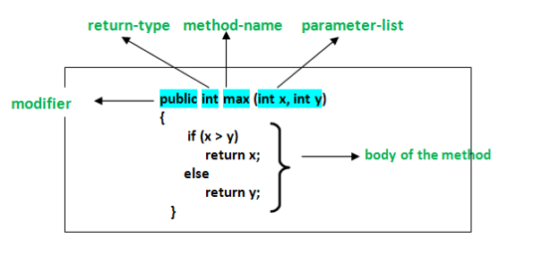
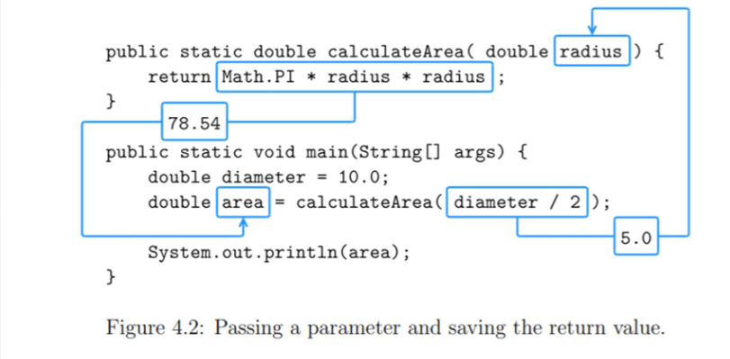
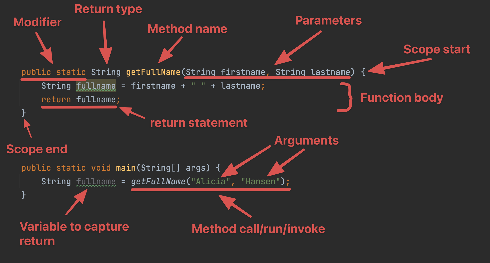

# Methods

When writing Java we often times have to do repetitive tasks. 

- Check that this user is logged in
- Get all the comments for a specific Post
- Create a new user


 Methods help us manage these repetitive tasks


## Lets begin with a good old metaphor

Imagine you have a huge machine. The machine has lots of things you can control. Like a lever, 3 buttons, a pulley and wheel and much more. All of this affects what happens inside the machine. It works by giving the machine some input. Now the input is transformed through the machine and in the end you get an output. 


Imagine now that the machine is actually a **method**, the inputs in Java is called **arguments**, the things that control the method are called **parameters**, the output of the machine is called a **return value**. That might not make a lot of sense for now, but keep the metaphor of the machine, it will get handy later on!


## Working with methods


### Creating a method

Let's create a method that will double any number we give it!

```java
public static int doubleNumber(int number) {
		return number * 2;
}
```

Let's disect the code

- `public` and `static` - these two keywords will later on become meaningful for you. But for now they are not so relevant. 
- `int` - Tells Java that the method will return an integer
- `doubleNumber` - This is the name of the method. It could be called anything
- `(int number)` - Inside the paranthesis we put the parameters of the method. 
- `return number * 2;` - Inside the brackets is the code the method will run (called the body of the method). `return` tells Java to return a value when the method runs. In this example number times two




A method does not have to return anything. If it does not return anything we use the keyword `void`. As in the method is void(missing) of any return.

```java
public static void sayHi() {
    System.out.println("Hi!");
}
```


### Calling a method

**So** what we have created now is a method that can double numbers. But how can i use it? How do i activate it somehow??

To activate a method is in Java called to call a method. So lets try and call `doubleNumber` with a specific number!


```java
int integerThatIsDoubled = doubleNumber(4);
System.out.println(numberThatIsDoubled); // 8
```

- `int integerThatIsDoubled` - is a variable that will capture the returned value from the method
- `doubleNumber(4);` - Here we call the method by writing the name of the method followed by parenthesis. What is inside the paranthesis is called an argument (remember the machine input metaphor!)




---


Let's take another example!

```java
public class main {
    public static void main(String[] args) {
        String fullname1 = getFullName("Sharmila", "Jensen");
        System.out.println(fullname2); // Sharmila Jensen

        String fullname2 = getFullName("Mads", "Hansen");
        System.out.println(fullname2); // Mads Hansen
    }

    public static String getFullName(String firstname, String lastname) {
        return firstname + " " + lastname;
    }
}
```

Here we create a method called `getFullName` that add's two string together with a space in-between. The method is called twice. 

The parameters take on the value that the method is called with! Or put in another way they are substituted with the values the method is called with.

The first time the two parameters `firstname` and `lastname` is substituted for `"Sharmila"` and `"Jensen"`. The second time they are substituted for  `"Mads"` and `"Hansen"`

The returned value from calling the method is captured by `fullname1` and `fullname2`





## Method scope

Method scope works in the same way as block scope. This means that a variable defined within a method is not accessible outside that method. 


````java
public static void sayHi() {
		String hiString = "Hi!"
    System.out.println(hiString);
}

System.out.println(hiString); // hiString is not defined within this scope!
````


## Exercises

After one hours of exercises its peer review time!


### Exercise 1.1

Write a method that takes three integers as parameter, sums the integers and returns the result.


### Exercise 2

Write a method that takes a String as parameter and prints the String twice. The method does not return a value.


### Exercise 3

Implement a BMI calculator method. Identify the needed parameters and return type.


### Exercise 4

Write a method that takes a String as parameter and returns the String in full uppercase.


### Exercise 5

Write a method that takes a String as parameter and returns the amount of characters in the given String.


### Exercise 6

Lav en metode der ikke returnerer noget uden parameter kaldet `throwDice`. Dvs. metoden returnerer ikke noget og modtager ingen input. 

Metoden skal generere et tilfældigt tal ml. 1 - 6 og udskrive det på skærmen.

Hvis værdien er 6 skal du skrive `6, Lucky you 🎲`


### Exercise 7 - Flight booking fullname function

 A customer from a flight booking website has asked  for our help creating a specific part of their application:

When a user books a flight they **write their firstname and surname**, but when the ticket is printed a **fullname should be displayed**. It is our responsibility to create that.

Create a function called `getFullname` that returns a fullname. It should have two parameters: `firstname` and `surname`.

```java
String fullname = getFullname("Benjamin", "Hughes"); 
System.out.println(fullname) // "Benjamin Hughes"
```

 `firstname` and `surname` should come from the user


#### Formal fullname

On the flight website the user has the possibility to **check a checkbox** that **indicates** if the user wants to be **adressed formally**. They also specify their gender. Lets also change `getFullname` to include support for formal name.

Create two extra parameters one that will contain the gender, the other that will indicate if the user wants to be adressed formally or not. 

```
getFullname("Camilla", "Jensen", "female", true); // returns "Lady Camilla Jensen"`
getFullname("Benjamin", "Hughes", "male", false); // returns "Benjamin Hughes"
```

Now create a small program simulating a bit of a flight booking process using the method you just created. 

*Taken from https://github.com/HackYourFuture-CPH/JavaScript/blob/master/javascript1/week2/homework.md*


### Exercise 8 - Weather wear

Create a function (that you have to name) that has temperature as  parameter. Based on the temperature it should return a string with what  the user should wear. The temperature should come from the user

An example is:

```
String clothesToWear = youCreateThisFunctionName(18);
System.out.println(clothesToWear); // Prints out: "shorts and a t-shirt"
```

[](https://camo.githubusercontent.com/9962d50527fe5a11527943cc192ca91cb28277241d2493509b8acd0234af21a6/68747470733a2f2f6d656469612e67697068792e636f6d2f6d656469612f32367536647279755a4839387a354b75592f67697068792e676966)

*Taken from https://github.com/HackYourFuture-CPH/JavaScript/blob/master/javascript1/week2/homework.md*


### Exercise 9 - Event application

Another customer has contacted us. He works for a secret company that rimes with foogle. The customer works on their calendar application.  They need some functionality to help with writing what weekday an event  is held.

You specify how many days from today an event is being held. The  function then figures out what weekday the event is being held. Here is  an example:

Today is Sunday and the event is in 5 days. Therefore the event will be held on a friday.

```
// With todays weekday a tuesday
System.out.println(getEventWeekday(9)); // Prints "Thursday"

// With todays weekday a Friday
System.out.println(getEventWeekday(2)); // Prints "Sunday"
```

You should get the today's day from the system

Hint: use modulus, investigate how dates work in Java

*Taken from https://github.com/HackYourFuture-CPH/JavaScript/blob/master/javascript1/week2/homework.md*


### Exercise 10.1

Calculate the sum of digits of a number given by user. 

E.g.

- INUPT: 123. OUPUT : 6 

- INUPT: 12345. OUPUT : 15 


### Exercise 11

A three digit number is called Armstrong number if sum of cube of its digit is equal to number itself. 

E.g.- 153 is an Armstrong number because (1<sup>3 </sup>)+(5<sup>3 </sup>)+(3<sup>3 </sup>) = 153. Write all Armstrong numbers between 100 to 500.

