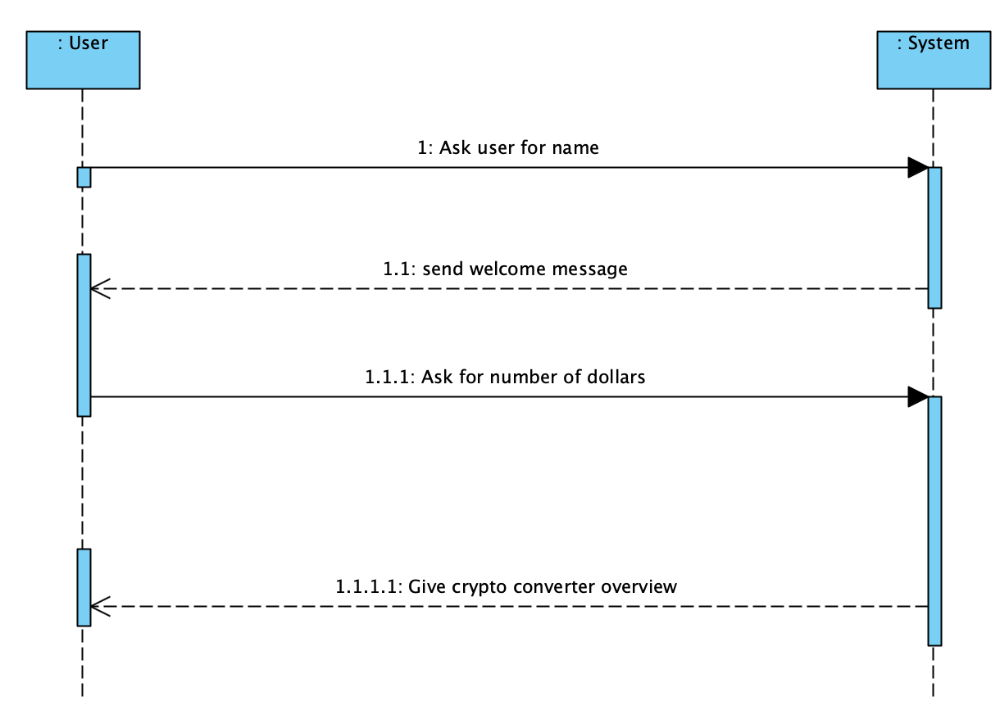

# System Sequence diagrams

System sequence diagrams is a way to visualize input and output events related to a system. More specifically it describes how external actors interact with a software system.

System events should be expressed at the abstract level of intention. 

