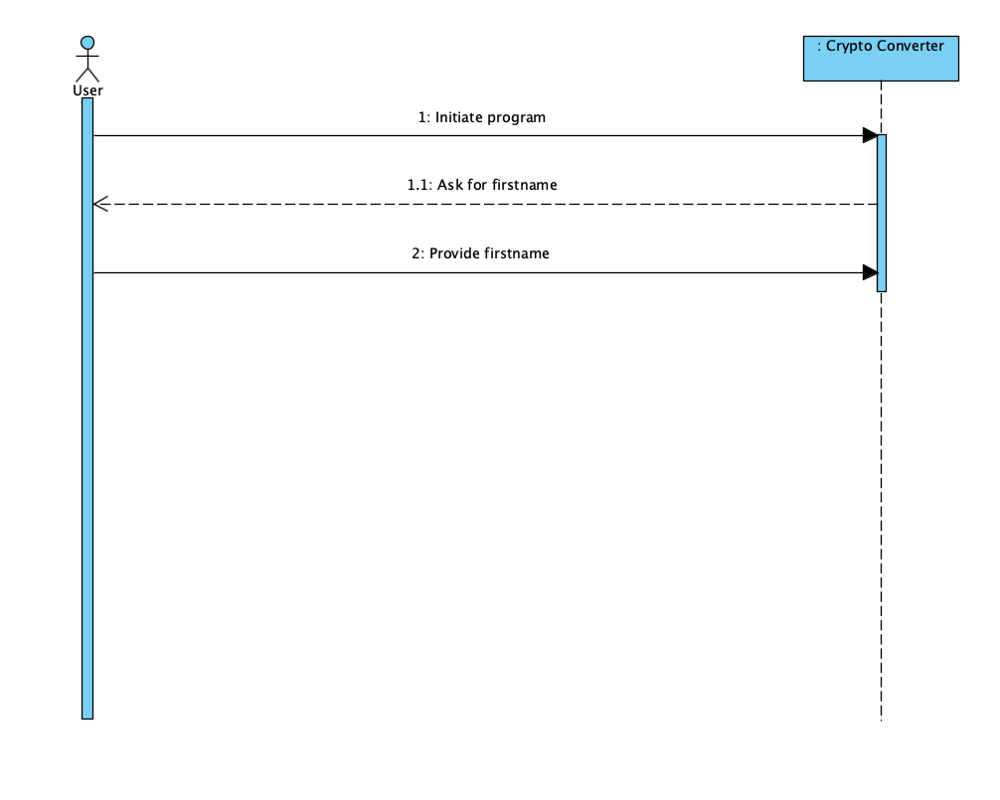

# System Sequence diagrams

System sequence diagrams is a way to visualize input and output events related to a system. More specifically it describes how external actors such as users interact with a software system.

Brief coverage of subject:

https://youtu.be/pCK6prSq8aw

