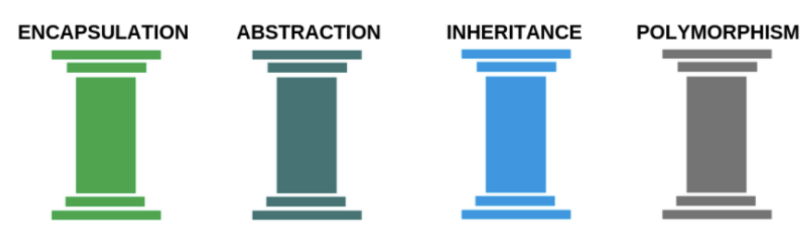

# 4 pillars of OOP

Watch this video as support 👇

https://youtu.be/GpjpqhthnnU


Java has 4 pillars it is built upon 👇





Lucky for you we have already talked about 2 out of the 4 pillars. That is:

- Abstraction - Abstraction is about abstracting code away. This can be achieved by creating methods, creating an `Interface` or an `Abstract` class. 
- Inheritance - The inheritance pillar is obvioulsy about inheritance and how objects can inherit properties from another object


The 2 pillars we have not talked about are

- Encapsulation - How we can control what objects can see and interact with data inside another object. 
- Polymorphism - How methods and classes can act in different ways. It means one name many forms. 


Let's first talk about Encapsulation!


## Encapsulation

Let's again use the `User` class from earlier!

```java
public class User {
    public String username;
    public String password;

    public User(String username, String password) {
        this.username = username;
        this.password = password;
    }

    public String generateNewPassword() {
        return "asd123";
    }
}
```

You have learned about most of creating a class but we have not talked about the `public ` keyword. 

`public` is a access modifier that tells Java who have access to the attribute. In this example `username`, `password` and `UserInheritance` (the constructor) and `generateNewPassword` are public. That means that all those attributes and methods can be called on the object.

```java
User mieParker = new User("Mie Parker", "fairydust");
System.out.println(mieParker.username); // Mie Parker
System.out.println(mieParker.password); // fairydust
System.out.println(mieParker.generateNewPassword()); // asd123
```

Accessing the attributes `username` and `password` is not good because all the data that is inside the `mieParker` object can be accessed by everone that has the object. 


### Let's improve this using encapsulation

```java
public class User {
    private String username;
    private String password;

    public User(String username, String password) {
        this.username = username;
        this.password = password;
    }

    public String generateNewPassword() {
        return "asd123";
    }
}
```

Now we have used the access modifier `private` instead. This means that `username` and `password` now only can be accessed within the class!

```java
User mieParker = new User("Mie Parker", "fairydust");
System.out.println(mieParker.username); // Java error
System.out.println(mieParker.password); // Java error
System.out.println(mieParker.generateNewPassword()); // asd123
```

So what if we still want to access or change `username` or `password` from outside the class using an object. Then we use getter's and setter's


### Getters and setters


#### Getter method

Getter methods are methods that give access to the some `private` attribute. 

```java
public String getUsername() {
	return username;
}
```

It's simply a method that returns the `private` attribute. 


#### Setter method

Setter methods are methods that give access to set/change some `private` attribute. 

```java
public void setUsername(String username) {
  this.username = username;
}
```

It is a method that changes the `private` attribute. 


#### Let's use it

```java
User mieParker = new User("Mie Parker", "fairydust");
System.out.println(mieParker.getUsername()); // Mie Parker
mieParker.setUsername("mieP");
System.out.println(mieParker.getUsername()); // MieP
```


### Encapsulation best practice

How should you then use this moving forward?

Here are some best practices 👇

- **Always** set all attributes as `private`
- Make getter and setter methods for the relevant attributes. Consider each one!
- Think about access modifiers for methods. If a method should only be used within the class, make it `private`. Otherwise make it `public`


Another example: A User that has a cpr attribute should not be changed


### Final user version

```java
public class User {
    private String username;
    private String password;

    public User(String username, String password) {
        this.username = username;
        this.password = password;
    }

    public String generateNewPassword() {
        return "asd123";
    }

    public void setUsername(String username) {
        this.username = username;
    }

    public void setPassword(String password) {
        this.password = password;
    }

    public String getUsername() {
        return username;
    }

    public String getPassword() {
        return password;
    }
}
```


## Polymorphism

Gå igennem en liste af objekter der overholder et interface. Kalde deres metode. Metoderne opfører sig forskelligt selv om de hedder det samme

Polymorphism means that entities behave differently based on the context. In Java it means a bit more specifically that we can create the same task in different ways!

Let's take an example:

We create a `Geometry` interface that has a method called `getArea`. All geometries have areas but how they implement that area depends on the geometry

```java
interface Geometry {
	double getArea();
}
```


Let's create a `Rectangle` and a `Circle` class that implements `Geometry`

```java
public class Rectangle implements Geomerty{
    private double height;
    private double width;

    public Rectangle(double height, double width) {
        this.height = height;
        this.width = width;
    }

    @Override
    public double getArea() {
        return height * width;
    }
}
```


```java
public class Circle implements Geomerty{
    private double radius;

    public Circle(double radius) {
        this.radius = radius;
    }

    @Override
    public double getArea() {
        return Math.pow(radius, 2) * Math.PI;
    }
}
```


Now we create two objects:

```java
Circle circle = new Circle(10);
Rectangle rectangle = new Rectangle(10, 10);

Geometry[] geometries = {circle, rectangle};
for (Geometry geometry : geometries) {
    double area = geometry.getArea();
    System.out.println(area); 
}
```

The loop first prints out `314.1592` then `100.0`


## Exercises

Igennem alle disse opgaver, husk at lave alle attributter `private` og kun at lave getter og setters for dem i har brug for!


### Exercise 4

Det her er en stor opgave i ikke bliver færdige med. Men i kan gå igang med den. Den læner sig ikke nødvendigvis op af abstrakte klasser eller interfaces, men måske i kan finde et godt sted at bruge det!?

https://kea-fronter.itslearning.com/LearningToolElement/ViewLearningToolElement.aspx?LearningToolElementId=809533
