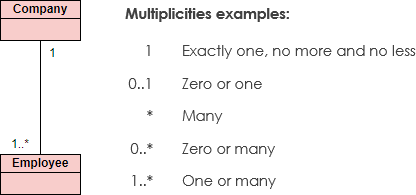
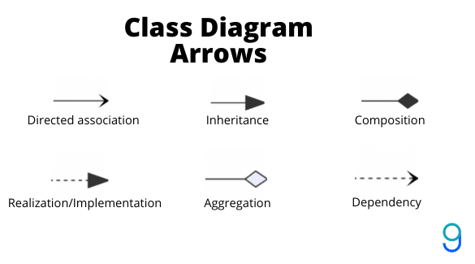
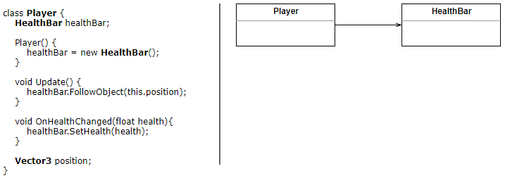
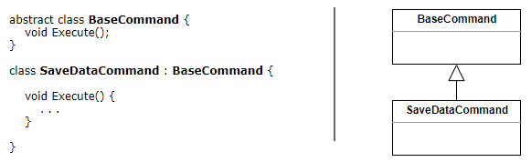
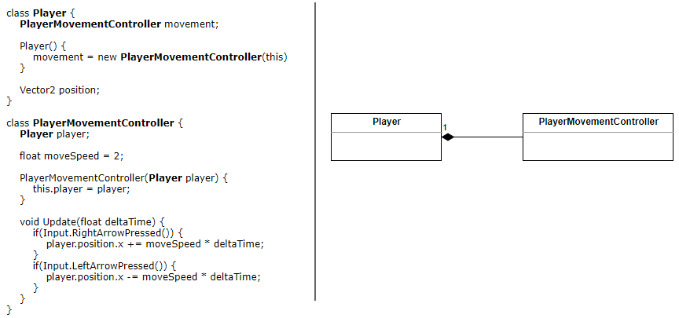
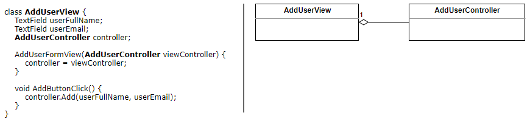
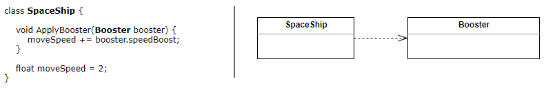
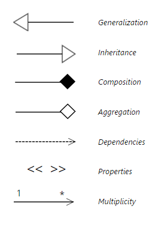

# Class diagrams

A class diagram is a way to visualize your classes. It can be very helpful to get an overview of the code that has been created. especially thinking about how different classes interact with each other. 

Class diagram made in IntelliJ

Methods are also called operation or behaviour. 

## Multiplicity

## Ralations - arrows

### Directed association

An Association reflects relation between two classes. Use Association arrow when two classes **need to communicate** and either (or both) class(es) **hold reference** to the second one. Association relationship is *“stronger”* than Dependency relationship, it implies a closer connection between entities.

### Inheritance

Use Inheritance when you want to show that one class inherits from another one. Forms a is-a relationship.

### Composition

Composition implies that two classes are associated and it adds the following details: within a Composition sub-objects are **strongly dependent** on a whole. Objects of the types are **instantiated together** and have **common lifecycle**.

A human needs a heart to live and a heart needs a human body to function  on. In other words when the classes (entities) are dependent on each  other and their life span are same (if one dies then another one too)  then its a composition.

### Aggregation

Aggregation implies that two classes are associated, it brings in more details regarding the nature of the relationship: the **child can exist independently** of the parent.

The best way to understand this relationship is to call it a “has a” or  “is part of” relationship. For example, consider the two classes: Wallet and Money. A wallet “has” money. But money doesn’t neccessarily need to have a wallet so it’s a one directional relationship.

### Dependency

Dependency relationship implies that two elements are dependent on each other. It is used to reflect that one class **interacts with another one**, receives an instance this class as a **method parameter**. Compared to Association, Dependency relationship is weaker.

Class diagram made in Visual Paradigm

