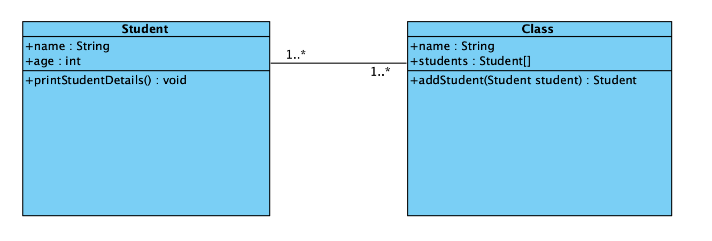
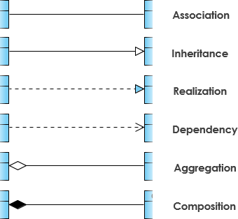

# Class diagrams

This video is super good: https://www.youtube.com/watch?v=UI6lqHOVHic&t=478s


A class diagram is a way to visualize your classes. It can be very helpful to get an overview of the code that has been created. especially thinking about how different classes interact with each other. 


Class diagram made in IntelliJ


Methods are also called operation or behaviour. 


Class diagram made in visual Paradigm




## Relations - arrows

There are some different relations between classes that we should talk about





### Inheritance

Use Inheritance when you want to show that one class inherits from another one. Forms a is-a relationship.


### Association

Indicates that there is a connection between two classes. 

```java
class Food {
	public String name;
	
	public void addKetchup(Ketchup ketchup) {
		...
	}
}
```

Here a class has a method that as parameter uses another class. That is what is understood by association


### Composition

When a child object cannot exist without its parent object. A finger cannot exist without the hand. Or a hand is **composed of** fingers.

A human needs a heart to live and a heart needs a human body to function  on. In other words when the classes (entities) are dependent on each other and their life span are same (if one dies then another one too)  then its a composition.


### Aggregation

The best way to understand this relationship is to call it a “has a” or  “is part of” relationship. For example, consider the two classes: Wallet and Money. A wallet “has” money. But money doesn’t neccessarily need to have a wallet so it’s a one directional relationship.

Another example is books and bookstores. A book can exists without being in a bookstore. 


### Multiplicity/cardinality


### Real world example


## Exercises


### Exercise 1


### Exercise 2

Create the Java code for this diagram


### Exercise 3

Create the code for this diagram


### Exercise 4

https://kea-fronter.itslearning.com/LearningToolElement/ViewLearningToolElement.aspx?LearningToolElementId=858632
