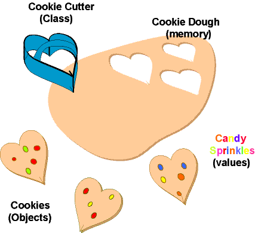
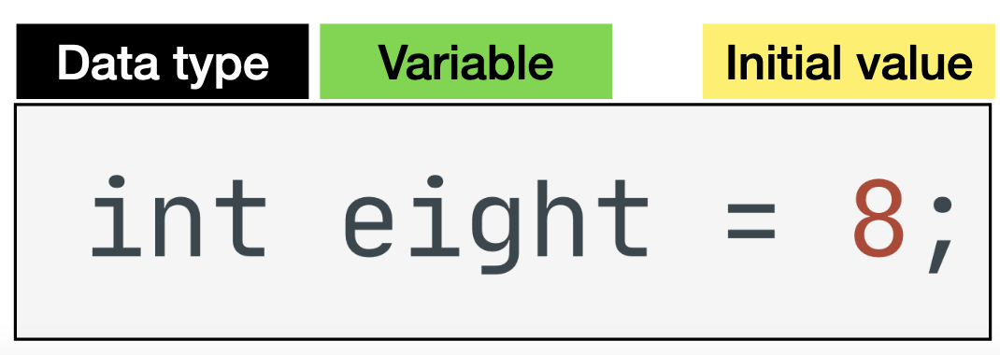
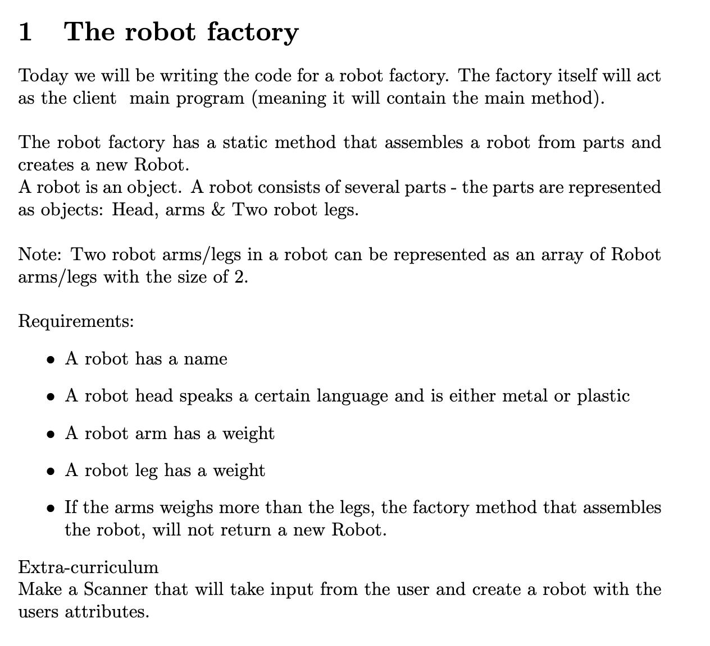

# Classes

You have now learned all the necessary building blocks of Java. `String`, `int`, `forloop`, `methods`, `conditional` these are all blocks that we need to build Java. **But** in order to write code that is 

- Better structured
- Better abstracted
- More maintainable
- More secure

we need to talk about classes! 

It's an essential part of Java that allows us to represent data in a better way.


## But why??

Let's go through a concrete example where classes can help us writte better code. 

Let's say we have an application that works with students. It could be an application that creates schedules for a school. 

Let's say a student has a name, an age and an array of his/her grades. Lets try and represent that with the code we have learned so far:

```java
String studentName = "Cathrine Hansson";
int age = 23;
int[] grades = {10, 4, 7, 7};
```

Okay, so this kind of works. I could do some operations on the individual variables, like finding the highest grade. But now a new student comes in, hmm. Okay let's rewrite the code👇

```java
String studentName1 = "Cathrine Hansson";
int age1 = 23;
int[] grades1 = {10, 4, 7, 7};

String studentName2 = "Peter Jon";
int age2 = 27;
int[] grades2 = {12, 4, 4, 7};
```

Hmm okay that's not super nice. What if there were 200 students in the system, then i would have to create 200 students * 3 attributes = 600 variables. This would simply not work and would be **massively** error prone. So then what? In comes classes. 


## Object orientation

- As applications grows - their code base grows
- As growth implies complexity, it is beneficial to organise code into 
  understandable & manageable groupings.
- Object orientation is a concept - “philosophy” - of writing programs.
- We hide complexity through abstraction


### Thinking object oriented


Let's look at creating a student. What parameter could be relevant? What is the blueprint of a Student. 





**Cookie cutter (blueprint)**

```java
class Cat {
    public String name;
    public int mood;
    public boolean isHungry;
    public int energy;

    public void meow() {
        System.out.println("meow");
    }
}
```

Here we create a new class called `Cat` with 4 attributes: `name`, `mood`, `isHungry` and `energy`. We also add a method to the class called `meow`


**Cookies (objects/instance of Student)**

```java
import java.util.Random;
import java.util.Scanner;

public class CatStarter {
    public static void main(String[] args) {
        Cat figaro = new Cat();
        figaro.meow();
        figaro.name = "figaro";
    }
}
```

Here we instantiate a new instance/object of the `Cat` class by saying

`Cat figaro = new Cat();`. `Cat figaro` means create a variable with the name of figaro, the type should be `Cat`. To create the object we say `new Cat();`. This will create a new object.


### Constructor





As we saw before we could change the name of `figaro` by writing 

```java
figaro.name = "figaro";
```

There is a better way to do this using the constructor. Lets update the `Cat.java` class:


```java
class Cat {
    public String name;
    public int mood;
    public boolean isHungry;
    public int energy;

    public Cat(String name, int mood, boolean isHungry, int energy) {
        this.name = name;
        this.mood = mood;
        this.isHungry = isHungry;
        this.energy = energy;
    }

    public void meow() {
        System.out.println("meow");
    }
}
```

Let's create a new object using the constructor

```java
public class CatStarter {
    public static void main(String[] args) {
        Cat figaro = new Cat("figaro", 5, true, 7);
        figaro.meow();
        System.out.println(figaro.name); // "figaro"
    }
}
```

The constructor is a method that constructs the object. 

When we create a new object we say `Cat figaro = new Cat("figaro", 5, true, 7)`; So we call this method 👉 `Cat("figaro", 5, true, 7)` . The method that is called is the constructor! The constructor looks like this:

```java
public Cat(String name, int mood, boolean isHungry, int energy) {
  this.name = name;
  this.mood = mood;
  this.isHungry = isHungry;
  this.energy = energy;
}
```

The constructor takes parameters but does not have a return type!

The parameters will be replaced with the arguments you create the object with. Just like how arguments and parameters work in methods. 


### `this`

`this` refers to the instance of the object. 

 `figaro` and `this` is the same thing but inside a class we use `this` to refer to the instance of the object! That means that we set the name (`"figaro"`) that came from creating a new object to be the name of the object. 


### `toString`

Printing out the values inside an object can be very helpful! But when we `println` an object it gives us `Cat@4f023edb`. This print the name of the class and the Dashcode. We can't really use this for anything. 

```java
Cat figaro = new Cat("figaro", 5, true, 7);
System.out.println(figaro); // Cat@4f023edb
```

In order to print an object's attributes we have to create a `toString` method 👇

```java
@Override
public String toString() {
    return "Cat{" +
            "name='" + name + '\'' +
            ", mood=" + mood +
            ", isHungry=" + isHungry +
            ", energy=" + energy +
            '}';
}
```

In the `toString` method we simply return a string with the values we would like to show. Ignore the `@override` annotation for now. You will learn that soon!

In IntelliJ there is a shortcut for generating the `toString` method automatically. 

```java
Cat figaro = new Cat("figaro", 5, true, 7);
System.out.println(figaro); // Cat{name='figaro', mood=5, isHungry=true, energy=7}
```


## Relationships

Has a 

Is a


## Enum

An `enum` is a special "class" that represents a group of  **constants** (unchangeable variables, like `final` variables)

We create an enum by making a new java class and writing the following:

```java
enum Level {
  LOW,
  MEDIUM,
  HIGH
}
```

Lets say we wanted to represent rock, paper, scissors. Since there cannot be any other hands to play than those three it would make a lot of sence to represent this as a `enum`

```java
enum RockPaperScissor {
  Rock,
  Paper,
  Scissor
}
```


## Exercises

Hvis ikke nok, kig på Codelab's opgaver!


### Exercise 1

Create a dog class

- 4 attributes that you choose
- 1 method that you choose
- Create 2 instances of dogs using the constructor!

Now call the method on the two dog objects


### Exercise 2

Create a `DogFarm` class that creates and returns `Dog` objects with data inputtet from the user.

The maximum / minimum of mood, energy & hunger is 10 / 0

If a method that raises an attribute to more / less than 10 / 0 - The attribute do not change, but prints out - Cat is at max / min [mood/energy/hunger]


### Exercise 3 - Robot factory




### Exercise 4 - Lampeopgave 

1. Skriv en klasse der hedder Lampe. 

2. En lampe har en boolean instansvariabel der angiver om den er tændt eller slukket. 

3. Når man laver et nyt lampe-objekt skal der være en konstruktør hvor man kan vælge om lampen som udgangspunkt er tændt eller slukket, samt en  tom konstruktør hvor lampen som udgangspunkt er slukket (dette kaldes  ”overload” af konstruktøren). 

4. Skriv en metode der hedder trykPåKontakt, som tænder lampen hvis den er slukket, og slukker lampen hvis den er tændt. 

5. Lav en klasse (du kan fx kalde den Værelse) med en main-metode hvor du  instantierer forskellige lampeobjekter (skrivebordslampe, sengelampe el. lign.) og tester om de virker som de skal. 

6. Lav en static variabel i Lampe-klassen som tæller hvor mange lamper der er lavet
