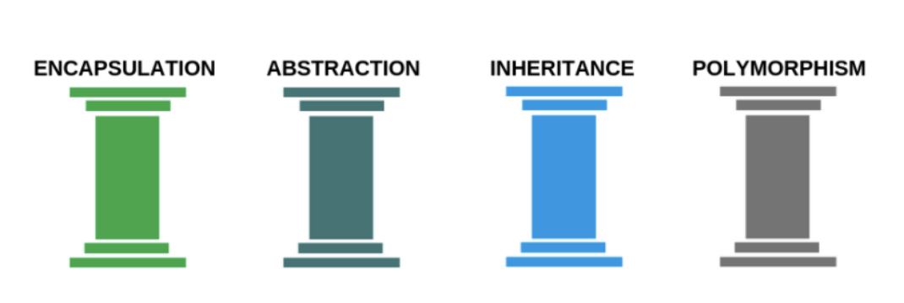
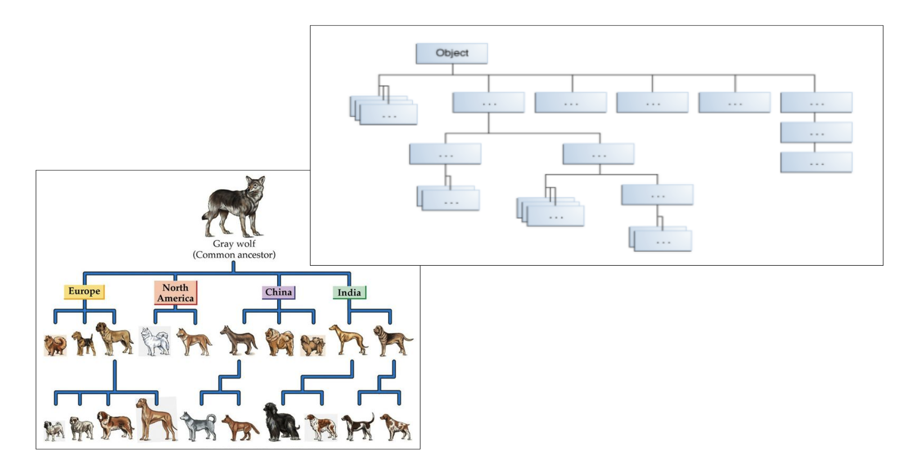
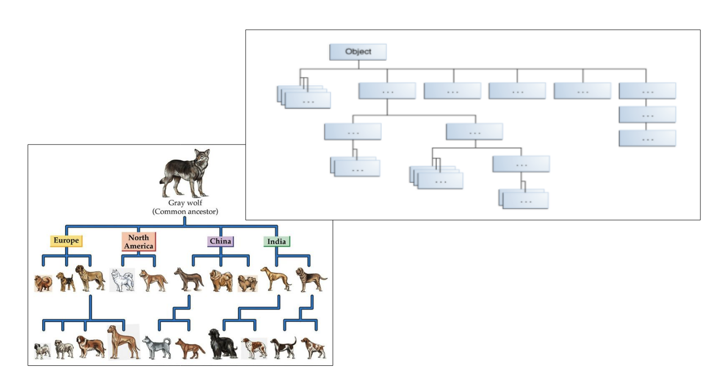
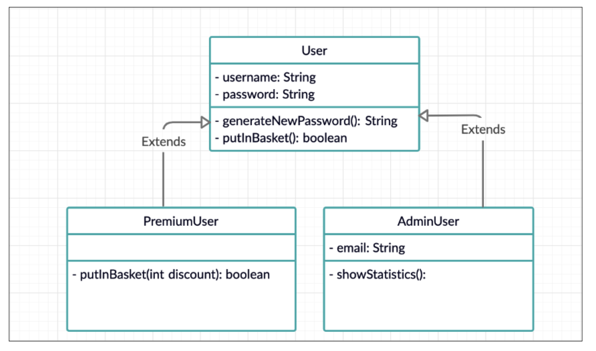

# Inheritance


## 4 pillars of OOP inheritance







## Why does inheritance make sense



Because we dont want to repeat ourselves. D.R.Y. - Dont repeat Yourself

- All users should have a username and a password and all users should be able to generate a new password. 
- Only the Admin has a email attribute and can show statistics




### Lets try and create this without inheritance


**User.java**

```java
public class User {
    public String username;
    public String password;

    public User(String username, String password) {
        this.username = username;
        this.password = password;
    }

    public String generateNewPassword() {
        return "asd123";
    }

    public boolean putInBasket() {
        return true;
    }
}
```


**PremiumUser.java**

```java
public class PremiumUser {
    public String username;
    public String password;

    public PremiumUser(String username, String password) {
        this.username = username;
        this.password = password;
    }

    public String generateNewPassword() {
        return "asd123";
    }

    public boolean putInBasket(int discount) {
        return true;
    }
}
```


**AdminUser.java**

```java
public class AdminUser {
    public String username;
    public String password;
    public String email;

    public AdminUser(String username, String password, String email) {
        this.username = username;
        this.password = password;
        this.email = email;
    }

    public String generateNewPassword() {
        return "asd123";
    }

    public String showStatistics() {
        return "Fancy statistics";
    }
}
```

This code should not be to foreign for you. We create 3 classes that have different attributes. **But** we are repeating ourselves quite a lot. 


### Now lets try with inheritance

**User.java**

`User.java` looks exactly the same as before!


**PremiumUser.java**

```java
public class PremiumUserInheritance extends User {
    public PremiumUserInheritance(String username, String password) {
        super(username, password);
    }

    public boolean putInBasket(int discount) {
        return true;
    }
}
```


**AdminUser.java**

```java
public class AdminUserInheritance extends User {
    public String email;

    public AdminUserInheritance(String username, String password, String email) {
        super(username, password);
        this.email = email;
    }

    public String showStatistics() {
        return "Fancy statistics";
    }
}
```

### Override


## Encapsulation

Changing to private!


TL:DR Data & methods are bundled in objects - well implemented encapsulation 
prevents direct access to the data to prevent unwanted changes in data

I.E Only make acceptable changes of cats available to the users of a cat object


### But why even have encapsulation?

- A person (object) is born with a CPR-number. It cannot be changed (for the sake of the example) 
- A cat (object) can maximum have 10 happiness points 
- What is the disadvantage of public attributes?


Static hvornår skal det ind? Måske senere


## Exercises

Write  an  abstract  class  called  ”Animal”.   An  animal  has  3  attributes:  name, nrOfLegs  &  isMammal.  Animals  can  also  produce  sounds  (represented  as  astring of the sound), and every animal produces a unique sound.

Create 3 animal classes that all extends the abstract Animal class and overridesthe method produces their unique sound.

Create an array, add your animals to the list and print every animals sound
