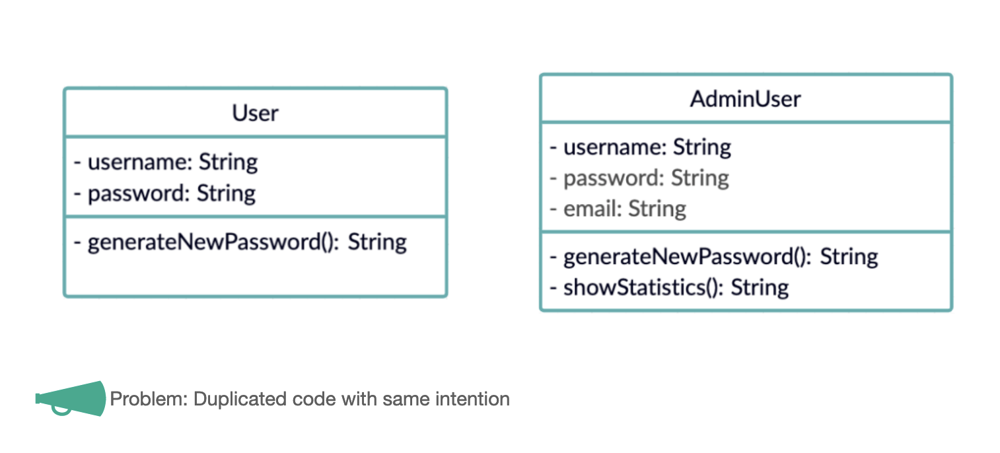

# Inheritance

## 4 pillars of OOP inheritance

## Why does inheritance make sense

Because we dont want to repeat ourselves. D.R.Y. - Dont repeat Yourself

- All users should have a username and a password and all users should be able to generate a new password. 
- Only the Admin has a email attribute and can show statistics

