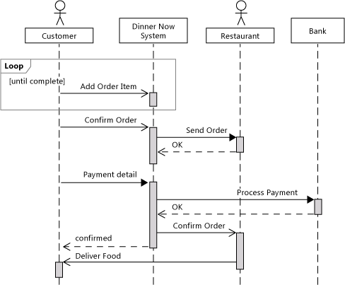

# Sequence diagram

A sequence diagram shows how objects in a system or classes interact with each other. 

They show the sequence of events

## Lifelines

Shows the actors over time. Moving down the line means that more time has passed. 

## Exercises

### Exercise 1

Explain and write down with your own words what this sequence diagram does.

### Exercise 2

Take a previous project you made and make at least two sequence diagrams.

