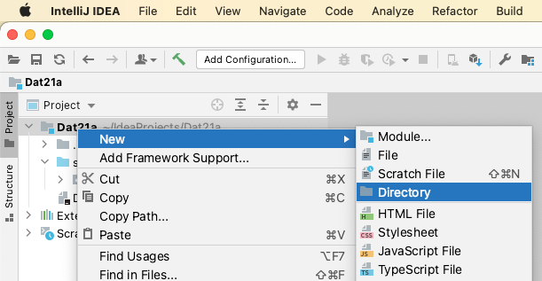
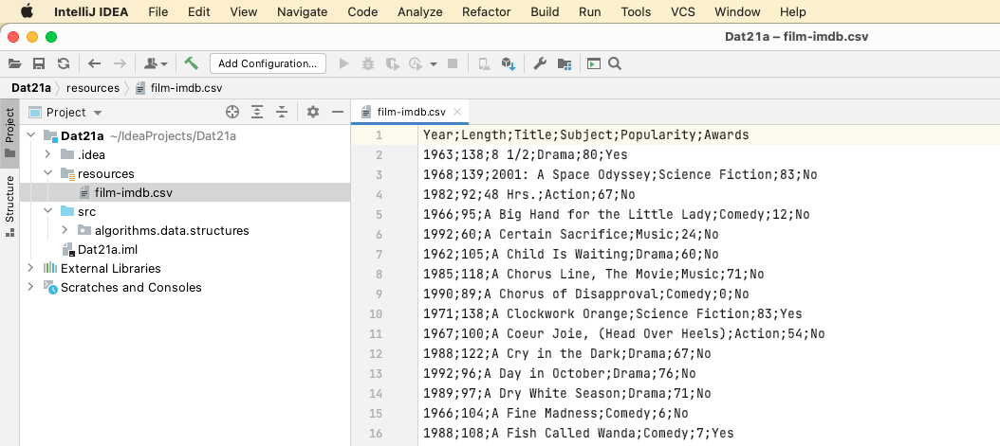

# Reading a file

Files are means of **persistance**. Peristance refers to the ability to keep, store & contain data, without a running program. 

When a program stops executing, all of the variables, data and state are effectively wiped from memory.

## File formats

Files have different formats - some are human readable such as .txt files others are meant to be read by a machine such as a .class file.

We will be working with .csv files.

 

A .csv file is structured as a table, meaning that it has columns & rows, each row representing an entity.

Each of the rows in the .csv file above represents a movie (entity) from IMDB.

## How to read files

The approach to reading files in java is to refer to the file on disk by its path.

The file is afterwards read by a scanner in a loop and each loop iteration refers to a line in the file.

Files can both be read word by word - or in our context line by line.

In the example we will be consuming a file line by line and printing it to the screen.

## Pseudo-code

**Refer to the file on disk**

**Read it with a scanner**

**While the scanners has input**

​	**Print the file**

## Setup

New directory created for resources such as data files



File placed in the folder (dragged and dropped)




## Code

```java
package algorithms.data.structures;

import java.io.File;
import java.io.FileNotFoundException;
import java.util.Scanner;

public class FileReader {
    public static void main(String[] args){
        try{
            File filmFile = new File("resources/film-imdb.csv");
            Scanner sc = new Scanner(filmFile);
            while(sc.hasNextLine()){
                String movieDetails = sc.nextLine();
                System.out.println(movieDetails);
            }
        }catch(FileNotFoundException e){
            System.out.println("Could not find file");
        }
    }
}
```

## Exercise: Movie-Analysis

**End product:**

A console based program that reads a data-set and provides the user with detailed insight about movies

## Data

[movies.csv](reading-a-file.assets/movies.csv) 

## Components

**FileReader**: A class that reads a file with a method that returns an arraylist of movie objects

(1) Implement functionality such that you can print each movie string from the film-imdb.csv file

(2) Refactor the code such that each movie are stored as Movie objects in an arraylist

**AnalysisEngine**

An object that instantiates & calls the FileReader method. 

AnalysisEngine implements methods to find answers for the following questions:

- What movie has the longest name?
- How many movies are from the Star Trek franchise?
- What is the average length for a movie in hours?
- What is the highest amount of words in a movie title from the list?
  - Example:
  - Wagon master has 2 words
  - Tie Me Up! Tie Me Down! has 6 words
  - Tie Me Up! Tie Me Down! has the maximum amount of words of this 2 title example
- How many movies won awards? 

##### Advanced analysis

- What year won the most awards?
- How many movies are sequals?
- What movie has the most unique consonant?

#### (Optional) Menu

- Write a menu that lets the user choose what question he/she wants answered

**If you finish fast - I have another data-set with advanced questions about Star Wars**