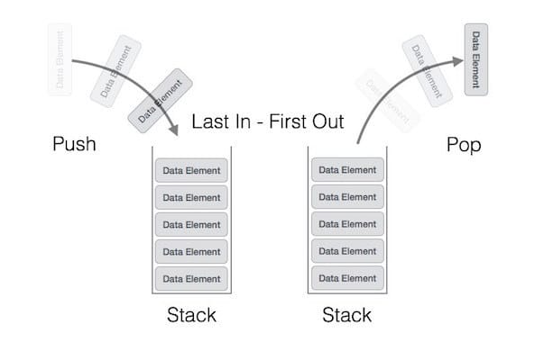
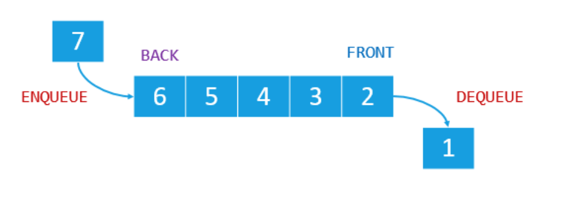

# Stack & Queue 

### Preparation

- Stack: https://youtu.be/FNZ5o9S9prU
- Queue: https://youtu.be/PjQdvpWfCmE

## What is a Stack?

A stack is first and foremost a foundational data structure, that takes inspiration from a physical stack of objects. 

In programming a stack is considered as an *Abstract* *Data* *Type*, meaning that a stack across multiple programming languages works the same way from a developers point of view. A stack always has push & pop methods, but the implementations differ across languages. In other words, if we know how a stack works in Java, we also know how it works in C++, Javascript, Python etc.

The foundational concept is: Last in First Out (LIFO)

A stack is a foundational data-structure used as a data structure in applications to:

- "Undo" mechanisms in Word, Excel or other text editors. All edits are kept in a stack, and if a user chooses to "Undo" the last the stacks pop(); method is called
- History of visited websites in your browser
- In many notification systems - the most recent notification appears first
- To resolve action sequences in card games such as Magic the Gathering

## What is a Queue?

A stack is a data structure that takes inspiration from the concept of physical queues.

In programming a queue is also considered as an *Abstract Data Type*, meaning that a queue across multiple programming languages works the same way from a developers point of view. 

The foundational concept is: First In First Out (FIFO)

A queue is a foundational data-structure used as a data structure in applications for:

- Ticket-ordering for events such as concerts, festivals etc. The person first in queue gets the first oppertunity to buy.
- Image-upload for multiple images to websites, social media blogs etc.
- Token/Buffer based processing such as java Scanner, BufferedReader etc.

